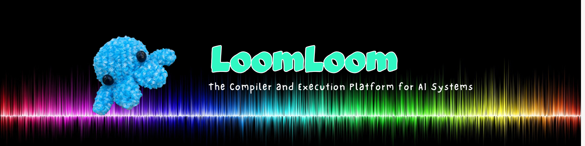
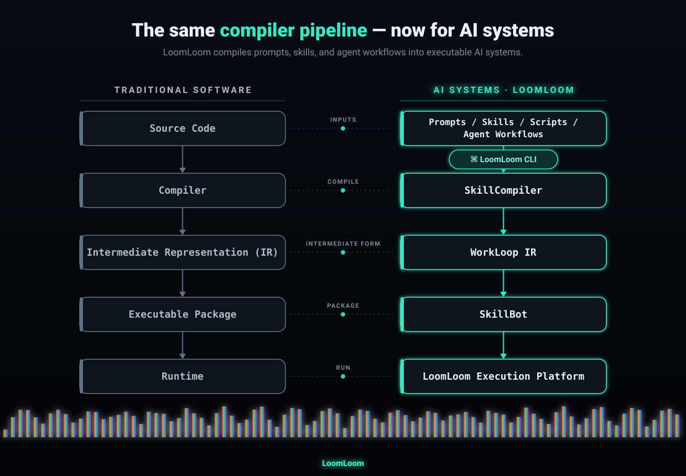

# ⚙️ LoomLoom — The Compiler and Execution Platform for AI Systems

<p align="center">
    <picture>
        <source media="(prefers-color-scheme: light)" srcset="references/loomloom.png">
        
    </picture>
</p>

<p align="center">
  <a href="https://github.com/Cogfoundry-ai/loomloom/releases">
    
  </a>
  
  <a href="#license">
    
  </a>
</p>

Just as a traditional compiler transforms source code into executable software, **LoomLoom transforms prompts, skills, scripts, and agent workflows into executable AI systems** — enabling reusable AI capabilities with lower token costs, higher efficiency, and more reliable execution.

LoomLoom is developed by [CogFoundry](https://cogfoundry.ai) and designed to run independently. Developers can use the [LoomLoom CLI](#1-loomloom-cli) and [SkillCompiler](#2-skillcompiler) anywhere — from local development to third-party AI platforms and [managed execution platforms](#where-to-run-loomloom).

For scalable production execution or IP protection, package compiled AI systems as SkillBots and deploy them through the LoomLoom Execution Platform powered by CogFoundry.

[Why LoomLoom](#why-loomloom) · [How LoomLoom Works](#how-loomloom-works) · [Architecture](#architecture) · [CLI Reference](references/cli-reference.md) · [Template Docs](docs/template-spec/00-template-spec.md) · [Use Cases](#what-you-can-build) · [Quick Install](#quick-install) · [DeepWiki](https://deepwiki.com/Cogfoundry-ai/loomloom) · [Discord](https://discord.gg/cogfoundry)

## Why LoomLoom?

AI software is often written in Python, JavaScript, or another programming language. But the most important part of its behavior is usually expressed somewhere else:

- prompts and instructions;
- skills and reusable capabilities;
- tool definitions;
- agent plans;
- multi-step workflows;
- model selection and routing;
- evaluation criteria and memory.

Traditional software tools are built to optimize code, but they are not designed to analyze, compile, and improve this AI behavior layer. LoomLoom is built for this new layer.

The SkillCompiler analyzes AI systems across their full execution pipeline. It optimizes workflow structure, reduces unnecessary model calls, improves model compatibility, and generates an inspectable compiled representation that developers can run locally, on third-party platforms, or through CogFoundry.

In internal tests on real-world batch workloads, LoomLoom running on the CogFoundry execution platform has shown significant improvements in AI system performance:

- Execution success rate increased from ~60% to ~96%;
- Average token consumption reduced by up to ~80%.

> These figures are preliminary and measured on internal workloads. Full benchmark results will be published with workload definitions, configurations, and comparison baselines.

By bringing compiler principles to AI development, LoomLoom helps developers build AI systems that are more efficient, reliable, and production-ready.

## How LoomLoom Works

LoomLoom combines five core components that bring compiler principles to AI development:

1. **[LoomLoom CLI](#1-loomloom-cli)** — the developer toolkit;
2. **[SkillCompiler](#2-skillcompiler)** — the compiler for AI systems;
3. **[WorkLoop IR](#3-workloop-ir)** — the intermediate representation (IR) for AI systems;
4. **[SkillBot](#4-skillbot)** — the deployable package format for AI systems;
5. **[Execution Platform](#5-loomloom-execution-platform)** — the production runtime for AI systems.

Together, they provide a complete toolchain for building, optimizing, and running AI systems.

LoomLoom brings the same proven compiler pipeline — the one that turns source code into running software — to AI systems, transforming prompts, skills, scripts, and agent workflows into executable, reusable AI:

<p align="center">
  
</p>

### 1. LoomLoom CLI

The LoomLoom CLI is a developer toolkit that extends your existing AI development workflow. Use it with your preferred AI development environment — such as [Claude Code](https://claude.com/product/claude-code), [Codex](https://openai.com/codex/), [Cline](https://cline.bot), [OpenClaw](https://openclaw.ai/), [WorkBuddy](https://www.codebuddy.cn/work/), [MCP](https://modelcontextprotocol.io)-based tools, or local agent workflows — to build, compile, test, and run AI systems.

Developers use the CLI to:

- create, develop, and inspect Skills;
- define workflow inputs and outputs;
- compile and optimize AI systems;
- generate tests and evaluation cases;
- inspect compilation results;
- package Skills as SkillBots;
- optionally deploy to the CogFoundry execution platform.

The CLI is open and portable. Developers can use LoomLoom locally or with any compatible AI execution environment.

### 2. SkillCompiler

SkillCompiler is LoomLoom's AI system compiler. Traditional compilers transform source code into executable software. SkillCompiler applies the same principle to AI development — transforming prompts, skills, workflows, and agent capabilities into structured, executable AI systems.

SkillCompiler is platform-independent. Developers can use it to optimize and compile AI systems for their own runtime, third-party platforms, or the CogFoundry execution platform.

Typical compiler inputs include:

- natural language prompts;
- local `SKILL.md` definitions;
- prompt libraries;
- Python or CLI workflow descriptions;
- existing agent workflows;
- test cases and expected outputs;
- optimization goals such as cost, latency, quality, and reliability.

The compiler produces:

- structured instructions and context;
- input/output schemas;
- workflow steps and dependencies;
- optimized prompts and tool usage;
- WorkLoop IR representation;
- executable DAGs;
- generated tests and evaluations;
- model compatibility and routing recommendations;
- cost, latency, and reliability reports.

The goal is simple: make AI systems perform more useful work with fewer tokens, fewer failures, and more predictable execution.

### 3. WorkLoop IR

WorkLoop IR is LoomLoom's intermediate representation (IR) for AI systems. Just as traditional compilers transform source code into an intermediate representation before generating executable programs, LoomLoom compiles prompts, Skills, scripts, and agent workflows into WorkLoop IR before execution.

WorkLoop IR provides a stable contract between AI logic and the execution runtime. Instead of relying on opaque chat history or repeatedly generating execution plans, developers work with a structured, inspectable representation that can be optimized, tested, and executed consistently.

WorkLoop IR describes:

- workflow steps and dependencies;
- typed inputs and outputs;
- sequential, parallel, and conditional execution;
- model and tool assignments;
- memory scope and reusable context;
- caching and intermediate-result policies;
- validation and quality gates;
- retry and recovery policies;
- execution budgets and constraints;
- final artifacts and delivery requirements.

The SkillCompiler transforms AI logic into WorkLoop IR, then compiles it into an execution DAG:

```text
Natural Language / Skills / Scripts / Agent Workflows
      │
      ▼
WorkLoop IR
      │
      ▼
Optimized Execution DAG
      │
      ▼
Stateful, Parallel AI Execution
      │
      ▼
Verified Result Artifacts
```

This compiler pipeline makes AI systems explicit instead of implicit. Developers can inspect, optimize, test, and version AI workflows before execution, while the runtime can execute them more efficiently through parallelism, intelligent model routing, caching, partial retries, and deterministic execution.

### 4. SkillBot

A SkillBot is the deployable package format for AI systems, proposed by CogFoundry. Just as a Docker image packages an application for deployment, a SkillBot packages a reusable AI capability for execution, distribution, and monetization.

A SkillBot includes:

- a typed input/output interface;
- compiled workflow logic;
- tests and quality gates;
- model and tool policies;
- version history;
- execution and delivery rules;
- optional IP protection for proprietary workflows.

Developers can use the LoomLoom CLI and SkillCompiler without publishing anything. When an AI system is ready, they can optionally package it as a SkillBot and deploy it to the CogFoundry Execution Platform.

Once packaged, a SkillBot can be:

- invoked through API, MCP, or the CLI;
- installed into supported AI agents and applications;
- embedded into websites or products;
- shared privately within a team or organization;
- published to the SkillBot Marketplace;
- billed per execution or per verified result;
- monetized with built-in creator attribution and revenue settlement.

### 5. LoomLoom Execution Platform

The LoomLoom Execution Platform is the managed runtime for compiled AI systems, powered by CogFoundry. It executes AI systems as stateful, observable, multi-step jobs with built-in:

- parallel execution;
- model routing;
- retries and recovery;
- caching;
- artifact management;
- usage metering;
- execution settlement.

Developers can use LoomLoom independently through the CLI and SkillCompiler. The Execution Platform is an optional layer for teams that require production-grade reliability, scalability, and operational control — or want to package and distribute AI systems as SkillBots while protecting their intellectual property.

## Who It's For

### For AI Developers

Build, optimize, and deploy AI systems with compiler-based workflows.

- Optimize prompt-driven and workflow-driven AI systems.
- Reduce unnecessary token consumption and model calls.
- Improve execution speed, reliability, and quality.
- Reuse the same compiled AI systems across different models and runtimes.
- Export, package, or deploy compiled systems anywhere.

### For Skill Creators and AI Experts

Turn expertise into reusable, executable AI products.

- Package expertise as reusable SkillBots.
- Protect proprietary prompts, workflows, and execution logic.
- Deliver AI capabilities as a service instead of sharing raw instructions.
- Monetize through execution-based or result-based pricing.
- Reach users through APIs, MCP, CLI, AI agents, and the SkillBot Marketplace.

### For Agent Platforms

Extend your ecosystem with production-ready AI capabilities.

- Add SkillBot capabilities without building a complete execution infrastructure.
- Integrate specialized AI capabilities through standard interfaces.
- Let creators provide expert workflows while CogFoundry handles execution, metering, billing, and settlement.

## What You Can Build

LoomLoom can transform repeatable AI workflows into executable, reusable AI systems:

- Turn a vague coding request into an implementation-ready task for Claude Code, Codex, Cline, or other AI coding environments.
- Analyze codebases and pull requests for security, quality, and engineering risks.
- Run large-scale model, prompt, and agent evaluations with consistent workflows.
- Process hundreds or thousands of spreadsheet rows and generate structured outputs.
- Generate personalized marketing, sales, or content assets in parallel.
- Convert research methods into reusable research SkillBots.
- Package expert playbooks into protected, callable AI services.
- Build expert AI websites and applications powered by SkillBot APIs.

```
One-off AI interaction → Compiled AI system → Repeatable execution
```

## Quick Install

**macOS / Linux**

```bash
curl -fsSL https://raw.githubusercontent.com/Cogfoundry-ai/loomloom/main/install.sh | bash
```

**Windows (PowerShell)**

```powershell
irm https://raw.githubusercontent.com/Cogfoundry-ai/loomloom/main/install.ps1 | iex
```

New to LoomLoom? Start here: [**Getting started**](references/getting-started.md) — for agent-assisted install, version pinning, the Gitee mirror, credential setup, and more.

## How Execution Works

LoomLoom is designed for production AI systems, not one-off conversational demos. Instead of generating a response from a single prompt, LoomLoom compiles AI work into a structured execution plan, applying compiler techniques to optimize execution, improve observability, and enable reuse.

```text
Input
      │
      ▼
Understand and structure the task
      │
      ▼
Compile into WorkLoop IR
      │
      ▼
Generate and validate an execution DAG
      │
      ▼
Route each step to the optimal model or tool
      │
      ▼
Execute independent steps in parallel
      │
      ▼
Cache results, handle retries, evaluate outputs, and deliver artifacts
      │
      ▼
Return an observable, reusable, and billable result
```

By converting AI workflows into explicit execution plans, LoomLoom enables more predictable and efficient execution:

- fewer unnecessary model calls;
- better resource utilization;
- parallel task execution;
- automatic recovery from failures;
- consistent evaluation and delivery.

For batch and workflow-based workloads, the LoomLoom architecture is designed to deliver significant execution efficiency improvements. Actual performance depends on the workflow structure, models, tools, data, and evaluation criteria. Benchmark results will be published with workload definitions, configurations, and comparison baselines.

## Architecture

LoomLoom separates AI system development, compilation, and execution into independent layers.

```text
Developer / Agent Environment
        │
        ▼
   LoomLoom CLI
        │
        ▼
  SkillCompiler
        │
        ▼
   WorkLoop IR
        │
        ▼
  Execution DAG
        │
        ├──────────────┐
        ▼              ▼
  Local / Third-       LoomLoom Execution Platform
  party Runtime              │
                             ├──> Workflow Runtime
                             ├──> Agent Sandbox
                             ├──> Model Executor & Router
                             ├──> Cache & Workflow Memory
                             ├──> Tests, Traces & Cost Ledger
                             │
                             ▼
                       SkillBot Services
                       API / MCP / CLI · Marketplace Settlement
```

The same compiled AI system can run locally, on third-party platforms, or through the LoomLoom Execution Platform.

## Run Anywhere, Scale When Ready

LoomLoom is designed to work independently of CogFoundry. Develop, compile, and run AI systems anywhere. When you're ready for production, deploy them to the LoomLoom Execution Platform without changing your workflow.

```text
Develop with LoomLoom CLI
            │
            ▼
Compile and optimize AI systems
            │
     ┌──────┴──────┐
     ▼             ▼
  Run locally   Run on any AI platform
     └──────┬──────┘
            ▼
Package as a SkillBot (optional)
            │
            ▼
Deploy to LoomLoom Execution Platform
            │
            ▼
Reliable execution, observability, billing, and distribution
```

The LoomLoom Execution Platform adds production capabilities such as:

- stateful workflow execution;
- high-throughput parallel DAG execution;
- intelligent model and tool routing;
- distributed inference;
- caching and reusable workflow memory;
- checkpoints, retries, and partial reruns;
- artifact management and execution observability;
- protected (black-box) execution for proprietary SkillBots;
- usage metering, billing, and creator settlement.

Your AI systems remain portable. You own the source, choose where they run, and decide when to move to managed execution. CogFoundry is an optional production runtime for teams that need greater reliability, efficiency, operational control, and commercial distribution.

## Where to Run LoomLoom

The LoomLoom Execution Platform specification is implemented by multiple providers. Compile once with the LoomLoom CLI, then deploy to the execution platform that best fits your region and needs.

<table width="100%">
  <tr>
    <td align="center" width="50%">
      <a href="https://cogfoundry.ai">
        <picture>
          <source media="(prefers-color-scheme: light)" srcset="references/cogfoundry.svg">
          
        </picture>
      </a>
    </td>
    <td align="center" width="50%">
      <a href="https://shengsuanyun.com">
        <picture>
          <source media="(prefers-color-scheme: light)" srcset="references/shengsuanyun.svg">
          
        </picture>
      </a>
    </td>
  </tr>
</table>

- **[CogFoundry](https://cogfoundry.ai)** — The official reference execution platform from the team behind LoomLoom. Provides production-scale execution, agent runtime, model routing, workflow memory, observability, and SkillBot services.
- **[ShengSuanYun](https://shengsuanyun.com)** — A managed execution platform recommended for users in Mainland China, providing localized infrastructure and deployment support.

## Design Principles

- **Open** — compile and optimize AI systems without being locked into CogFoundry.
- **Structured** — make AI workflows explicit and executable before optimizing runtime performance.
- **Reusable** — compile repeatable AI work once and execute it many times instead of repeatedly recreating plans.
- **Executable** — optimize for reliable delivered results, not impressive but unpredictable chat interactions.
- **Portable** — support local and third-party runtimes, with CogFoundry as an optional managed execution layer.
- **Flexible** — choose the best model for each task instead of coupling workflows to a single provider.
- **Protected** — expose AI capabilities through interfaces while protecting proprietary prompts, workflows, and execution logic.
- **Observable** — track execution state, quality, latency, cost, and delivery outcomes for every run.
- **Accessible** — make SkillBots accessible through the tools and environments where users already work.

## Security

- Only send `LOOMLOOM_TOKEN` to the `LOOMLOOM_SERVER` you configured, over HTTPS.
- Never put real tokens in source, docs, screenshots, or logs.
- AI agents must get explicit user confirmation before paid or state-changing operations (for example, `submit-file`, `run submit`, `template-spec run`, `market run`, `listing publish`, or `listing unlist`).
- Do not blindly retry paid or state-changing commands after an ambiguous failure; check the relevant run, listing, review, or usage state first.

Full guidance: **[Security Notes](references/security.md)**. To report a vulnerability, see our **[Security Policy](SECURITY.md)**. LoomLoom is **beta** — breaking changes are possible before the first stable release.

## Contributing

Contributions are welcome — browse [open issues](https://github.com/Cogfoundry-ai/loomloom/issues) or open a pull request. See **[CONTRIBUTING.md](CONTRIBUTING.md)** for guidelines on reporting bugs, proposing features, and submitting changes, and our **[Code of Conduct](CODE_OF_CONDUCT.md)** for community expectations.

Having trouble? See **[Troubleshooting & FAQ](references/troubleshooting.md)**.

## License

LoomLoom uses a **layered licensing model** that separates open standards, open-source code, and commercial runtime services. At a glance:

| Layer | What it covers | License |
|---|---|---|
| **Open specification** | WorkLoop IR — the open interoperability spec | [Apache-2.0](LICENSE) |
| **Open-source components** | Source code explicitly marked `Apache-2.0` | [Apache-2.0](LICENSE) |
| **Proprietary components** | SkillCompiler, LoomLoom Execution Platform, managed runtime services, and platform infrastructure | CogFoundry Binary License |

**Open specification & open-source components.** WorkLoop IR's specification documents, and any source file explicitly marked `Apache-2.0`, are licensed under the Apache License 2.0. Refer to the applicable [LICENSE](LICENSE) file and source-file headers for the governing license.

**Proprietary components.** Some components are proprietary technologies developed by CogFoundry:

- SkillCompiler
- LoomLoom Execution Platform
- Managed runtime services
- Commercial platform infrastructure
- Any other components explicitly identified as proprietary

These may be distributed as free-to-download developer binaries under the applicable CogFoundry Binary License. Using these binaries does **not** make the underlying source code open source, and does **not** grant permission to access, modify, reverse-engineer, redistribute, or operate them as a competing service — unless expressly permitted by the applicable license.

> [!IMPORTANT]
> The license included with each release governs that release and takes precedence over this summary. Commercial services — managed execution, the SkillBot Marketplace, billing, and revenue settlement — may be subject to separate commercial terms.

<p align="center">Made with ❤️ by <a href="https://cogfoundry.ai">CogFoundry</a></p>
