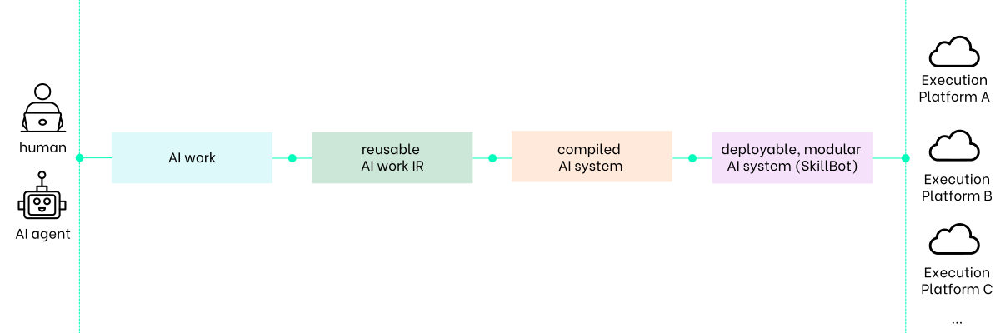
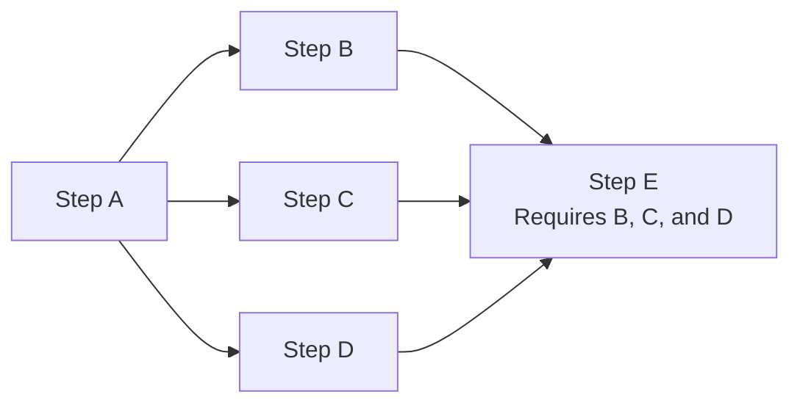

# loomloom

<p align="center">
    
</p>

<div align="center">

<b>AI work compiler and runtime.</b>

[](#status)
[](https://github.com/cogfoundry-labs/loomloom/releases)
[](https://www.apache.org/licenses/LICENSE-2.0)

</div>

## What's new

- 🚀 0.2.1 — First public beta release → [Release notes](https://github.com/cogfoundry-labs/loomloom/releases/tag/v0.2.1)

## AI work as software

The main goal of loomloom is to enable `AI work` to be compiled, packaged, and executed as reusable software — from local development to production-scale execution.

`AI work` can be created by developers, AI agents, or both working together. It defines the inputs, logic, and expected outputs required to produce an outcome. It can range from a single prompt or skill to a complete AI system, including the instructions, capabilities, workflows, and artifacts required to make it work.

`AI work` may include:

- Instructions or prompts that guide AI behavior
- Skills, scripts, and tools that extend capabilities
- Workflows that coordinate execution
- Artifacts generated by AI, such as code, documents, and data

loomloom provides a compiler and runtime layer for this new software primitive:

- Compile and package `AI work` into executable AI systems
- Execute AI systems across compatible runtimes
- Version, maintain, iterate, and distribute AI systems like software

## Quick start

Get loomloom installed on your local development machine using one of the following options:

- Visit https://cogfoundry.ai and follow the quick start instructions
- Install using the installation script or try the agent-assisted installation - see the [installation guide](docs/quick-start/installation.md)

Once installed:

```sh
# Show available loomloom commands
loomloom --help

# Show help for a specific command, e.g., the market command
loomloom market --help
```

## How loomloom works

loomloom treats AI work the same way a traditional compiler treats source code.

During compilation, loomloom analyzes the components of your AI work across its execution pipeline, optimizes workflow structure and AI model utilization, transforms AI work into an optimized intermediate representation (IR), and produces executable AI systems that can run through compatible runtimes, including execution platforms powered by CogFoundry or its licensed partners.

<div align="center">
<strong>The same compiler pipeline — now for AI systems</strong>

<br />


</div>

### Components

loomloom provides a complete compilation toolchain for `AI work` — including:

- an open-source developer toolkit (CLI)
- a reference implementation of the AI work compiler (SkillCompiler)
- a production execution platform (loomloom execution platform)

All built around the [IR spec](docs/ir-spec/en/README.md), enabling AI work to be transformed into deployable, modular AI systems through the compilation pipeline shown below:

<div align="center">
<br />

</div>

#### CLI — All-in-one developer toolkit

loomloom `CLI` is the developer interface for defining, compiling, executing, and managing AI work as software.

It works alongside your familiar AI agents and developer tools such as Claude Code, Codex, Cline, OpenClaw, and integrates seamlessly with MCP-compatible environments.

Developers use the `CLI` to:

- Define and transform `AI work` into reusable `AI work IR`, including its inputs, logic, and outputs
- Compile, execute, debug, and test `AI work IR`
- Package, version, publish, and distribute compiled AI systems as deployable, modular AI systems - or SkillBots

#### Reusable AI work IR — Intermediate representation for AI systems

Like the IR produced by a software compiler, reusable `AI work IR` is the inspected and optimized intermediate representation generated during compilation, providing a foundation for reliable, dependency-aware, parallel, and cost-effective AI system execution.

It describes the structures of steps (workflow steps within your `AI work`), AI model utilization, and execution policies, mapped in a way that explicitly models step dependencies. The IR lets the system discover independent steps that can execute in parallel and safely execute them together, while ensuring dependent steps never run before their required inputs are available.



<div align="center">

Discover safe parallel execution opportunities and execute them safely.

</div>

Reusable `AI work IR` represents the following information according to the [IR spec](docs/ir-spec/en/README.md):

- typed inputs and outputs
- workflow steps, dependencies, and execution flow
- sequential, parallel, and conditional execution semantics
- model and tool assignments, priorities, and policies
- memory scope and reusable context
- caching and intermediate-result strategies
- validation rules and quality policies
- retry, recovery, and failure-handling policies
- execution budgets and constraints
- final artifacts and output requirements

#### SkillBot — A deployable, modular AI system

Just as a Docker image packages an application for deployment, SkillBot packages a compiled AI system into a complete, deployable unit. A SkillBot can be deployed to any loomloom-compatible execution platform and invoked through APIs, MCP, or the CLI; installed into supported AI agents and applications; embedded into websites or online systems; or composed with other SkillBots, forming a modular AI system ecosystem.

Beyond the compiled AI system itself, SkillBot also includes the information required to transform a locally developed AI system into a production-ready, scalable execution unit:

- version history
- access rights
- optional IP protection for selected parts of the AI work
- monetization rules, including built-in creator attribution and revenue settlement when needed

#### SkillCompiler — Compile your AI work into AI systems

SkillCompiler is the default AI work compiler integrated into the loomloom `CLI`. It transforms the instructions, capabilities, workflows, and AI-generated artifacts that define AI work into reusable AI work IR, then compiles the IR into an optimized execution DAG and compiled AI system that can be packaged as a SkillBot.

SkillCompiler compiles AI work according to the [IR spec](docs/ir-spec/en/README.md). This enables the community to build alternative AI work compilers, specialized optimization engines, and alternative execution platforms that are compatible with each other, helping accelerate innovation across the AI ecosystem.

#### Execution platform — Production runtime

The loomloom execution platform is CogFoundry's reference implementation of a managed runtime for compiled AI systems. It executes SkillBots as stateful, observable, multi-step jobs with maximum safe parallelism, faithfully implementing the execution semantics, optimization strategies, and runtime policies defined in the reusable `AI work IR`.

Built-in runtime capabilities include:

- dependency-aware parallel execution
- strategy-based model and tool routing
- memory and context management
- caching and intermediate-result reuse
- validation and quality gates
- retries, recovery, and failure handling
- artifact management
- execution metering and settlement
- SkillBot licensing and revenue settlement

Execution platform runs compiled AI systems based on the [IR spec](docs/ir-spec/en/README.md). This allows anyone to build compatible platforms with their own runtime technologies, infrastructure, and optimization strategies while remaining interoperable with the same open standard.

Organizations that prefer a production-ready implementation can also license the loomloom execution platform from CogFoundry.

**Implementation status:**

- 🚧 loomloom is currently in beta. The core concepts, architecture, and initial implementations are available and working. Some features are already implemented, while others are under active development.
- ℹ️ Design details may evolve based on community feedback and real-world usage. Significant changes will be documented publicly.

## Examples

We are developing a collection of open-source SkillBot examples to demonstrate how loomloom transforms `AI work` into deployable, modular AI systems.

- These examples will show how developers can define, compile, and package `AI work` as SkillBots, providing a foundation for building their own AI applications and commercial solutions.
- The first batch of examples is expected to be released by the end of August 2026.

## Documentation

#### Tools

- [CLI reference](docs/reference/cli.md)

#### Development

- [How to install](docs/quick-start/installation.md)
- [Create your first **template** (AI work IR)](docs/guides/create-your-first-template.md)
- [Build your first SkillBot](docs/guides/build-your-first-skillbot.md)
- [loomloom workflows](docs/guides/workflows.md)
- [Developer docs](https://docs.cogfoundry.ai/documentation/overview/quickstart)

#### Design proposals (RFCs)

- [RFC-0001: Intent-first CLI](docs/rfc/0001-intent-first-cli.md)
- [RFC-0003: Model catalog strategy](docs/rfc/0003-model-catalog-strategy.md)

## Contributing

- Contributions are welcome — browse open issues or submit pull requests.
- Collaborators are invited based on contributions.
- Maintainers can push branches in the `loomloom` repository and merge pull requests into the `main` branch.
- Help with managing issues, pull requests, and projects is greatly appreciated.
- See [CONTRIBUTING.md](CONTRIBUTING.md) for more information.
