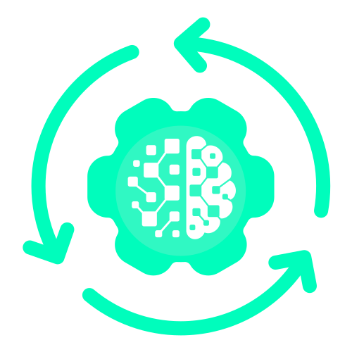
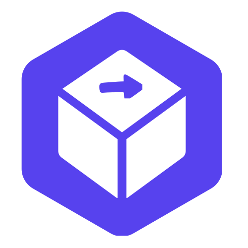

# Install loomloom CLI and agent skill

loomloom is a CLI for defining, compiling, executing, and managing AI work as software. npm installs the CLI only; the shell and PowerShell installers install both the CLI and the bundled `loomloom` agent skill when given an explicit Skill destination. See the [CLI reference](../reference/cli.md) for commands.

**Recommended:** if npm and the `skills` manager support your Agent, use [npm CLI and one-command Agent setup](#npm-cli-and-one-command-agent-setup). It requires one explicit Agent id and lets the manager select that Agent's supported Skill root.

#### Choose `--skill-dir` / `-SkillDir`

The installer does not detect or select an agent. Pass the complete destination for the bundled `loomloom` skill, ending in `loomloom`:

| Target agent | Complete destination |
| --- | --- |
| Codex | `<your Codex Skill root>/loomloom` |
| WorkBuddy | `~/.workbuddy/skills/loomloom` |

`--skill-dir` / `-SkillDir` selects the agent that receives the skill; it is not the CLI binary directory and is not a cross-agent default.

- Use the complete destination, not its parent Skills directory.
- Do not use `~/.codex/skills/loomloom` unless Codex is the target agent; it does not install the skill for WorkBuddy or another agent.
- If the target agent's skill root is unknown, ask the user or inspect that agent's configuration. After installation, verify that the selected destination contains `SKILL.md`.

The following sections describe how to install, configure, and uninstall loomloom on your local development machine using different options.

**Install:**
[npm CLI and one-command Agent setup](#npm-cli-and-one-command-agent-setup) · [Agent-assisted setup](#agent-assisted-setup) · [macOS / Linux](#macos--linux) · [Windows (PowerShell)](#windows-powershell) · [Verify the CLI and skill](#verify-the-cli-and-skill)

**Configure:**
[Browser login](#browser-login) · [API token fallback](#api-token-fallback) · [Verification and server profiles](#verification-and-server-profiles)

**Uninstall:**
[macOS / Linux](#macos--linux-uninstallation) · [Windows (PowerShell)](#windows-powershell-uninstallation)

## Install

### npm CLI and one-command Agent setup

The npm package installs the existing Go CLI and its matching platform binary
through the npm Registry. It does not download a binary from GitHub during an
npm lifecycle script:

```bash
npm install -g @cogfoundry/loomloom@beta
loomloom --version
```

For a temporary environment or CI job:

```bash
npx --yes @cogfoundry/loomloom@beta --version
```

`npm install` installs the CLI only; it never writes an Agent Skill directory.
For CLI plus the matching general LoomLoom Skill, run the explicit npm setup
command and name one target Agent:

```bash
npx @cogfoundry/loomloom@latest install --agent codex --yes
```

The setup command installs the same-version CLI globally, then delegates the
Skill directory selection to the `skills` manager. It verifies that the named
Agent reports the `loomloom` Skill before succeeding. In an interactive
terminal, omit `--agent` to enter an Agent id when prompted. In CI or an Agent
session, `--agent` is required.

The shell and PowerShell installers below remain supported for environments
that require an explicit complete `--skill-dir` / `-SkillDir`.

Stable CLI releases read a local update cache during ordinary text commands and
refresh it in the background at most once every 24 hours. An available update
is printed to stderr and never changes command behavior. Beta, rc, internal,
JSON-output, and CI users are not prompted; set `LOOMLOOM_NO_UPDATE_CHECK=1`
to disable the check explicitly.

### macOS / Linux

Set the complete loomloom skill destination for your agent, then install the latest stable release. Replace the example path before running the command:

```bash
LOOMLOOM_SKILL_DIR="/absolute/path/to/your/agent/skills/loomloom"
curl -fsSL https://raw.githubusercontent.com/cogfoundry-labs/loomloom/main/scripts/install.sh | bash -s -- --skill-dir "$LOOMLOOM_SKILL_DIR"
```

When `brew` is available, this default GitHub installation uses Homebrew to install or upgrade `cogfoundry-labs/tap/loomloom`. Otherwise, it downloads the CLI release to `~/.local/bin`. To force the GitHub Release path, add `--no-brew`.

For example, to install for WorkBuddy without Homebrew:

```bash
curl -fsSL https://raw.githubusercontent.com/cogfoundry-labs/loomloom/main/scripts/install.sh | bash -s -- --skill-dir "$HOME/.workbuddy/skills/loomloom" --no-brew
```

Notes:

- Use `--install-dir <path>` to choose a different CLI directory for the GitHub Release path. The default is `~/.local/bin`; Homebrew installations do not place the CLI there.

- Use `--version <tag>` for a specific release. When `--version` is `latest` (the default), `--channel` selects `stable` (the default), `beta`, `rc`, or `internal`:
  ```bash
  # Install a specific release tag
  curl -fsSL https://raw.githubusercontent.com/cogfoundry-labs/loomloom/main/scripts/install.sh | bash -s -- --skill-dir "$LOOMLOOM_SKILL_DIR" --version vX.Y.Z

  # Install the latest beta release
  curl -fsSL https://raw.githubusercontent.com/cogfoundry-labs/loomloom/main/scripts/install.sh | bash -s -- --skill-dir "$LOOMLOOM_SKILL_DIR" --channel beta
  ```

- To install from the Gitee mirror:

  ```bash
  curl -fsSL https://gitee.com/cogfoundry/loomloom/raw/main/scripts/install-gitee.sh | bash -s -- --skill-dir "$LOOMLOOM_SKILL_DIR"
  ```

### Windows (PowerShell)

Set the complete loomloom skill destination for your agent, then install the latest stable release using `irm`. Replace the example path before running the command:

```powershell
$LoomloomSkillDir = "C:\path\to\your\agent\skills\loomloom"
& ([scriptblock]::Create((irm https://raw.githubusercontent.com/cogfoundry-labs/loomloom/main/scripts/install.ps1))) -SkillDir $LoomloomSkillDir
```

Notes:

- By default, the CLI is installed to `$HOME\AppData\Local\Programs\loomloom`. Use `-InstallDir <path>` to choose another CLI directory.

- Use `-Version <tag>` for a specific release. When `-Version` is `latest` (the default), `-Channel` selects `stable` (the default), `beta`, `rc`, or `internal`:
  ```powershell
  # Install a specific release tag
  & ([scriptblock]::Create((irm https://raw.githubusercontent.com/cogfoundry-labs/loomloom/main/scripts/install.ps1))) -SkillDir $LoomloomSkillDir -Version vX.Y.Z

  # Install the latest beta release
  & ([scriptblock]::Create((irm https://raw.githubusercontent.com/cogfoundry-labs/loomloom/main/scripts/install.ps1))) -SkillDir $LoomloomSkillDir -Channel beta
  ```

- To install from the Gitee mirror:

  ```powershell
  & ([scriptblock]::Create((irm https://gitee.com/cogfoundry/loomloom/raw/main/scripts/install.ps1))) -SkillDir $LoomloomSkillDir -Source gitee
  ```

### Verify the CLI and skill

The installer reports the installed CLI and skill paths. Confirm that `loomloom` is available before continuing to configuration:

```bash
loomloom --help
test -f "$LOOMLOOM_SKILL_DIR/SKILL.md"
```

For a macOS/Linux GitHub Release installation, add `~/.local/bin` to your shell's `PATH` if `loomloom` is not found:

```bash
export PATH="$HOME/.local/bin:$PATH"
```

For Windows, add the selected `-InstallDir` (by default, `$HOME\AppData\Local\Programs\loomloom`) to `PATH` if needed, then run:

```powershell
loomloom --help
Test-Path "$LoomloomSkillDir\SKILL.md"
```

### Agent-assisted setup

If you use an AI agent that supports Skills, you can ask it to install and configure loomloom for you. The agent determines its supported skill root and passes the complete destination to the installer.

Copy the following prompt and send it to your AI agent:

```text
Install loomloom from:
https://github.com/cogfoundry-labs/loomloom

After installation, run:
loomloom doctor --output json

If no healthy server profile is configured, show me both preset platforms and let me choose one. Use browser login for the selected platform when possible, then run doctor again.
```

Notes:

- Recommended for most users. If you use this approach, you can skip the manual setup and verification sections below.

## Configure

Choose a configuration path: use [browser login](#browser-login) on an interactive machine with a preset platform; use [API token fallback](#api-token-fallback) for CI, a headless environment, a custom server, or when you prefer token authentication. The installer may print environment-variable commands; those belong to the API token fallback and are not required for browser login.

### Browser login

To get the loomloom CLI working, connect it to a loomloom server with a valid credential. Browser login is the preferred setup method for the CogFoundry and ShengSuanYun presets.

A loomloom server is an endpoint operated by an execution platform; it provides the managed runtime for compiled AI systems. In an interactive terminal, `loomloom login` lets you choose between the preset platforms. You can also pass the selected server explicitly:

```bash
loomloom login --server https://loomloom.shengsuanyun.com/loom/v1
loomloom login --server https://loomloom.cogfoundry.ai/loom/v1
```

The CLI verifies the returned credential before saving and activating the server profile. Use `--no-browser` to print the authorization URL, or `--login-timeout 10m` when more than the default five minutes is needed.

| Execution platform | loomloom server | API key fallback | Account and balance |
|:---|:---|:---|:---|
|  **CogFoundry** | `https://loomloom.cogfoundry.ai/loom/v1` | [API keys](https://console.cogfoundry.ai/api-keys) | [Credits](https://console.cogfoundry.ai/credits) |
|  **ShengSuanYun** | `https://loomloom.shengsuanyun.com/loom/v1` | [API keys](https://console.shengsuanyun.com/user/keys) | [Recharge](https://console.shengsuanyun.com/user/recharge) |

### API token fallback

Use an API token for a custom server, a headless or CI environment, or when you explicitly prefer token authentication. Verify the exact server/token pair first:

```bash
loomloom doctor --server <exact-server-url> --token <api-token> --output json
```

On success, `doctor` registers and activates the verified server profile. If it returns `next_action: "persist_token"`, store the token in the exact profile-specific environment variable returned in `token_env`. Do not reuse a token with another server or modify a custom server URL.

### Verification and server profiles

Run the following command after either authentication flow:

```bash
loomloom doctor --output json
```

Continue when it reports `healthy: true`. Manage verified server profiles with:

```bash
loomloom server list
loomloom server use <name-or-server>
loomloom server remove <name-or-server>
```

`loomloom logout` removes the saved browser credential for the selected profile. It does not remove an environment API token or the profile itself.

## Uninstall

The following commands uninstall the loomloom CLI and/or the bundled loomloom agent skill from your local machine. Complete and skill-only uninstallations require the same complete skill destination used during installation.

### macOS / Linux uninstallation

Uninstall using `curl`:

```bash
LOOMLOOM_SKILL_DIR="/absolute/path/to/your/agent/skills/loomloom"

# Uninstall loomloom CLI and the loomloom agent skill
curl -fsSL https://raw.githubusercontent.com/cogfoundry-labs/loomloom/main/scripts/uninstall.sh | bash -s -- --skill-dir "$LOOMLOOM_SKILL_DIR"

# Uninstall loomloom CLI only
curl -fsSL https://raw.githubusercontent.com/cogfoundry-labs/loomloom/main/scripts/uninstall.sh | bash -s -- --cli-only

# Uninstall the loomloom agent skill only
curl -fsSL https://raw.githubusercontent.com/cogfoundry-labs/loomloom/main/scripts/uninstall.sh | bash -s -- --skill-only --skill-dir "$LOOMLOOM_SKILL_DIR"
```

### Windows (PowerShell) uninstallation

Uninstall using `irm`:

```powershell
$LoomloomSkillDir = "C:\path\to\your\agent\skills\loomloom"

# Uninstall loomloom CLI and the loomloom agent skill
& ([scriptblock]::Create((irm https://raw.githubusercontent.com/cogfoundry-labs/loomloom/main/scripts/uninstall.ps1))) -SkillDir $LoomloomSkillDir

# Uninstall loomloom CLI only
& ([scriptblock]::Create((irm https://raw.githubusercontent.com/cogfoundry-labs/loomloom/main/scripts/uninstall.ps1))) -CliOnly

# Uninstall the loomloom agent skill only
& ([scriptblock]::Create((irm https://raw.githubusercontent.com/cogfoundry-labs/loomloom/main/scripts/uninstall.ps1))) -SkillOnly -SkillDir $LoomloomSkillDir
```

Notes:

- Uninstalling loomloom CLI does not remove your shell configuration or environment variables. Remove them manually if they are no longer needed.
