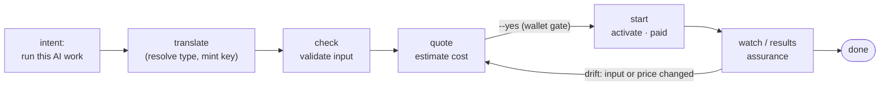
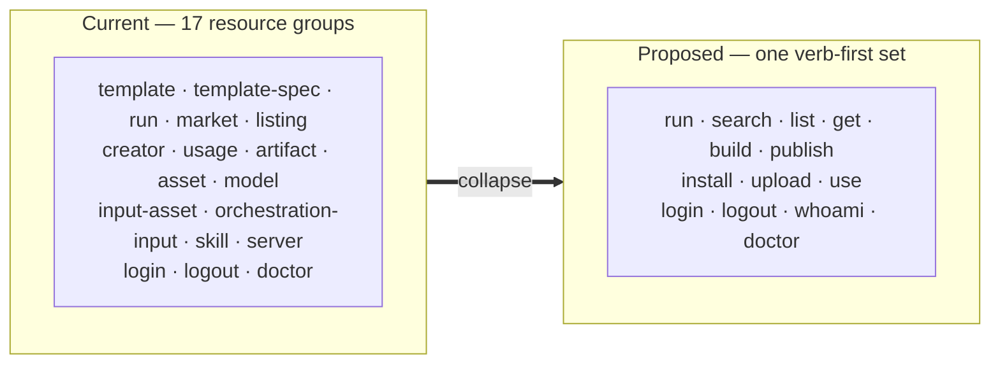
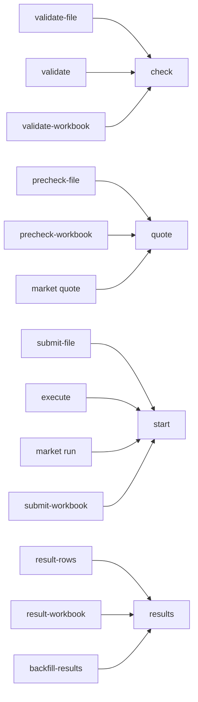

# RFC-0002: Intent-first CLI — command model, output, and migration

- **Status:** Draft
- **Author:** Max
- **Created:** 2026-08-08
- **Builds on:** [RFC-0001: Intent-first CLI](0001-intent-first-cli.md)
- **Discussion:** open for developer discussion

## Abstract

[RFC-0001](0001-intent-first-cli.md) set the *direction*: commands should express
**what the user wants to do**, not which backend resource they touch. This RFC turns
that direction into a concrete proposal covering the five follow-ups RFC-0001
promised: **command hierarchy, naming, output format, agent guidelines, and a
migration plan.**

The design is examined through **three lenses**, and part of this RFC's purpose is to
show where they agree and where they *pull against each other*:

1. **RFC-0001's principles** — intent first, progressive disclosure, hide internals.
2. **Intent-Based Networking (IBN)** — a mature discipline for driving *remote*
   infrastructure from declared intent through a closed loop of
   *translation → activation → assurance → remediation*. loomloom's LLM model
   services and execution platforms are remote infrastructure, so the analogy is
   surprisingly direct. (See [IBN survey](https://www.cse.wustl.edu/~jain/cse5700-25/ftp/ibn/index.html),
   [IETF IBN use-cases](https://www.ietf.org/archive/id/draft-irtf-nmrg-ibn-usecases-00.html),
   [Cisco IBN](https://www.cisco.com/c/en/us/solutions/intent-based-networking.html).)
3. **Agent-friendly CLI practice** — Zbigniew Sobiecki's
   [*Building agent-friendly CLIs*](https://zbigniew.me/writing/building-agent-friendly-clis/):
   stable, parseable, deterministic, non-interactive-safe.

Lens 2 and lens 3 **do not fully agree** — IBN pushes toward *abstraction and
autonomous closed-loop control*, while agent-friendly practice pushes toward
*explicitness and deterministic, human-gated steps*. [Part 5](#part-5--design-tension-ibn-autonomy-vs-agent-friendly-determinism)
raises this tension directly and asks other developers to help resolve it, rather than resolving it silently in the design.

Every non-obvious choice below carries a **Design consideration** box explaining
*why*, so reviewers can challenge the reasoning, not just the outcome.

---

## Terminology (canonical loomloom vocabulary)

This RFC uses loomloom's established vocabulary from the
[README](../../README.md) and the
[agent skill](../../skills/loomloom/SKILL.md). It deliberately **avoids the
word "workflow"**, which is off-vocabulary.

| Term | Meaning | Not called |
|---|---|---|
| **AI work** | The user's source asset — instructions, capabilities, steps, and AI artifacts. The thing you author, run, and publish. | "workflow", "job" |
| **TemplateSpec** | The JSON authoring format that *defines* an AI work — its steps, inputs, model bindings, and dependencies. The file you hand to `build`; written throughout as `<spec.json>` (a TemplateSpec `.json` file). | "config", "manifest" |
| **reusable AI work IR** | The inspected/optimized intermediate representation produced by compilation. | "config" |
| **compiled AI system** | The optimized execution DAG produced from the IR. | — |
| **SkillBot** | A published, packaged AI system — the result of `publish`. Every SkillBot lives on the Market, so there is **no separate "Market SkillBot"**; it is just a SkillBot. | "Market SkillBot", "public template", "plugin" |
| **official template** | A platform-maintained runnable AI work. | — |
| **private template** (+ **version**) | User-authored AI work created via **TemplateSpec**. | — |
| **run** | One execution instance of an AI work. | "task" (a task is a row *within* a run) |
| **Market** | The marketplace where published SkillBots are discovered and run. A place, not a command group. | — |
| **Listing** / **Listing Version** *(internal)* | The backend record behind a published SkillBot. **Never user-facing** — users only ever say "SkillBot" (and its "version"). | surfaced as "SkillBot" |

**Metavar convention.** Prose always uses the full concept name **"AI work."** The CLI
*argument* is shortened to **`<work>`** — a placeholder for a reference to any runnable
AI work: an official template id, a private template version, or a SkillBot id. The
short form matches the `work` collection noun in `list work`,
so `run <work>` and `list work` read consistently. (Same pattern as docs saying "a pull
request" while the argument is `<pr>`.)

> **Design consideration — `<work>` vs `<ai-work>` as the argument name.**
> Every runnable thing here *is* AI work, so the `ai-` prefix on the metavar is
> redundant, and `<work>` keeps the argument aligned with the `list work` collection.
> The risk is that bare "work" reads as generic; we contain it by (a) always spelling
> the concept "AI work" in prose, and (b) defining `<work>` once, here. Because users
> type a real id — never the literal `<work>` — this is a documentation-clarity choice,
> not a usability one.

> **Design consideration — why insist on "AI work" over "workflow"?**
> RFC-0001 already speaks of "run work, publish work," and the README builds its
> whole compiler metaphor on **AI work → IR → compiled AI system → SkillBot**.
> Introducing "workflow" would fork the vocabulary and undercut the one mental
> model the project has invested in. A CLI is documentation users type; its nouns
> must be the project's nouns. (The term has already leaked: the current binary's own
> root `--help` describes itself as *"Developer CLI for LoomLoom workflows."*)

> **Design consideration — one word for a published thing: "SkillBot".**
> The current model exposes three near-synonyms — "Market SkillBot", "Listing",
> "Listing Version" — plus "public template" in places. For a user, these are one
> thing: a **SkillBot** they published (or that someone else did). This RFC collapses
> them: you `publish` AI work and get a **SkillBot**; "Listing"/"Listing Version" stay
> as backend records the CLI never names; "Market" is the *place*, never a prefix on
> "SkillBot". This is the same "hide internal distinctions" rule that motivates
> collapsing official/private/Market in `run` (§0.2, §1.2) — applied to the noun.

---

## Part 0 — Gap analysis: where the current CLI stands today

Evidence base for the rest of the RFC. (Source: `cli/internal/cmd/*.go`,
[`docs/reference/cli.md`](../reference/cli.md), commit at time of writing.)

> **Verification method.** The numbers below were verified against the **built
> binary** (`go build ./cmd/loomloom`, Cobra v1.10.1). The command tree was walked
> programmatically via `--help` — **67 leaf commands under 17 groups** — and per-flag
> command counts and exit codes were probed on the running binary, not inferred from
> source. Where an earlier source string-grep disagreed with the binary, the binary
> wins and the text below reflects it.

### 0.1 Surface shape

- **17 top-level command groups**, almost all named after backend resources:
  `template`, `template-spec`, `run`, `market`, `listing`, `creator`, `usage`,
  `artifact`, `input-asset`, `orchestration-input`, `asset`, `model`, `skill`,
  `server`, plus `login`/`logout`/`doctor`.
- The **same user intent is split across groups**. "Run an AI work" exists as **six
  commands** depending on the resource: `template submit-file`, `run execute`,
  `template-spec submit-workbook`, `template-spec run`, `market run`, and
  `market workbook run`.
- **Lifecycle verbs are renamed per group**: validate is
  `validate-file`/`validate`/`validate-workbook`; estimate is
  `precheck-file`/`precheck`/`precheck-workbook`/`quote` (four names); submit is
  `submit-file`/`execute`/`run`/`submit-workbook` (plus a hidden legacy `submit`);
  results are
  `result-workbook`/`result-rows`/`backfill-results`.

### 0.2 Leaky internal concepts (RFC-0001 §Motivation)

- **`--client-request-id`** — an idempotency key — is user-facing on all **6** paid
  commands; the user must generate and track it by hand.
- **Monetary `*T` units** (`10,000,000 T = 1 currency unit`) surface in JSON and in
  field names (`taskFixedFeeT`, `amountT`, `estimatedTotalCostT`).
- **official vs. private vs. Market** is a taxonomy the user must understand just to
  choose a command.

### 0.3 Output contract (Sobiecki §Output)

- `--output text|json` (`-o`) exists — good — but: **no `{data, meta}` envelope**;
  pagination inconsistent (`--page-token` on 4 commands, `--limit` on only 2, **no
  `--all`, no cursor** that terminates with `null`); **text labels diverge from JSON
  keys** (`input_file_id` vs `inputFileId`); **no field projection** (`--fields`); and
  no `--json`/`--no-color`/`NO_COLOR` — the root exposes only `-o text|json`, and TTY
  is checked solely for interactive login and live `run watch`.

### 0.4 Errors and exit codes (Sobiecki §Errors)

- **Exactly one failure exit code** — `main.go` does `os.Exit(1)` for everything.
  Verified on the binary: unknown command, bad flag, missing required arg, bad
  `-o` value, and network-unreachable all exit `1`; there is no distinct code for
  usage vs. auth vs. network vs. not-found. No structured JSON error, no `suggestion`,
  no fuzzy-match.

### 0.5 Confirmation & non-interactive safety (Sobiecki §Non-interactive)

- Confirmation is `--confirm` on **only 2 commands** (`market run`,
  `market workbook run`); `--dry-run` on 3 (`skill install market`,
  `skill install template-spec`, `skill uninstall`); `--force` on 1
  (`skill uninstall`). No single uniform gate for "costs money / changes remote
  state" — the paid `run execute`, `template submit-file`, and `template-spec run`
  commands have **no** confirm flag at all, relying on `--client-request-id` alone.
  Idempotency is manual.

### 0.6 Inputs

- Large/structured input uses differently named flags: `--file` on 6 commands,
  `--input-file` on 4 (plus a `-f` shorthand). No `@path` convention.

### 0.7 Already good (keep)

Real `--json` mode; `doctor`; `run watch` TTY/terminal-state detection;
precheck→confirm→run safety instinct; and — Sobiecki's highest-leverage item — the
CLI already ships a paired **agent skill**.

### 0.8 Gap summary table

| Best practice | Today | Gap |
|---|---|---|
| Intent-first top level | Resource-first, 17 groups | 🔴 Large |
| One verb per concept | 4–5 names per lifecycle step | 🔴 Large |
| Hide internal details | `client-request-id`, `*T`, official/private/market exposed | 🔴 Large |
| Exit-code taxonomy | Only `1` | 🔴 Large |
| JSON envelope `{data, meta}` | Raw values | 🟠 Medium |
| Cursor pagination | `page-token`, inconsistent | 🟠 Medium |
| Text keys == JSON keys | snake vs camel | 🟠 Medium |
| Structured errors + suggestions | Plain strings | 🟠 Medium |
| Uniform `--yes` + `--dry-run` | `--confirm`, mixed | 🟠 Medium |
| Cross-cutting `search`/`get`/`whoami` | Per-resource `list` | 🟠 Medium |
| Uniform input flag / `@path` | 3 names | 🟡 Small |
| `NO_COLOR` / output TTY gating | Partial | 🟡 Small |
| CLI paired with agent skill | Present | ✅ Keep |

### 0.9 How this RFC closes each gap

Every gap above has a home in the design. This table is the index — the "so what" for
Part 0.

| Gap (from 0.1–0.6) | Fixed by |
|---|---|
| Resource-first, 17 groups | Intent verbs; management folded into `list`/`get` — §1.2, §1.4 |
| 4–5 names per lifecycle step | One verb per concept (`check`/`quote`/`start`/`results`) — §2.1 |
| **0.2 — `client-request-id` exposed** | **Auto-minted idempotency key, printed to stderr; `--idempotency-key` to pin — §2.1 rule 3, §4.1(4)** |
| **0.2 — `*T` money units leak** | **Money always rendered with a currency; raw `*T` only under `--raw` — Part 3.1** |
| **0.2 — official/private/Market taxonomy** | **`run <work>` resolves the type; `--kind` overrides only on ambiguity — §1.2, §5.2(3)** |
| Market SkillBot / Listing terminology | One user word, "SkillBot"; Listing is internal — Terminology, §1.4 |
| No `{data, meta}` envelope | Single envelope, `meta.nextCursor` — Part 3.1 |
| Inconsistent pagination | `--limit`/`--all`/`--cursor`, `null`-terminated — §2.1, Part 3.1 |
| Text keys ≠ JSON keys | One camelCase key set, text labels aligned — Part 3.1 |
| Only exit code `1` | Five-code taxonomy (0–5) — Part 3.2 |
| Plain-string errors | Structured `{error:{code,message,suggestion}}` — Part 3.2 |
| `--confirm` mixed | Uniform `--yes` + `--dry-run` on every paid/stateful op — §2.1, Part 4.1 |
| Per-resource `list` only | Cross-cutting `search` / `get` / `list` / `whoami` — §1.2 |
| 3 input flag names | One `--input <path\|@path\|->` — §2.1 |
| Partial `NO_COLOR`/TTY gating | Full TTY + `NO_COLOR` + `--no-color` — Part 3.1 |

> **On 0.2 specifically** — the three leaks (idempotency key, `*T` units,
> official/private/Market) are the ones RFC-0001 §Motivation calls out by name. Their
> fixes are, respectively: **hide** (auto idempotency), **translate** (currency-formatted
> money), and **infer** (`run <work>` resolves type). All three are instances of IBN
> checklist item 2 — *translation hides mechanism*.

---

## Part 0.5 — Intent-Based design checklist (adapted from IBN)

RFC-0001 names the goal "intent first" but does not define a *test* for it. IBN — a
discipline built precisely to drive **remote** infrastructure from declared intent —
gives us one. loomloom's remote LLM model services and execution platforms play the
role IBN's network devices play, so we can borrow IBN's closed loop as an evaluation
rubric.

> **Source.** The checklist below is **adapted from the Intent-Based Networking
> closed-loop lifecycle** — *intent expression → translation → activation → assurance
> → remediation*, over a *Business / Intent / Network* three-layer model — as defined
> in:
> - Aris Leivadeas & Matthias Falkner, *A Survey on Intent-Based Networking*, IEEE
>   Communications Surveys & Tutorials (2023) —
>   [full text](https://www.cse.wustl.edu/~jain/cse5700-25/ftp/ibn/index.html)
> - IETF NMRG, *Use Cases and Practices for Intent-Based Networking*
>   (`draft-irtf-nmrg-ibn-usecases`) —
>   [draft](https://www.ietf.org/archive/id/draft-irtf-nmrg-ibn-usecases-00.html)
> - Cisco, *Intent-Based Networking* (industry framing of the same loop) —
>   [overview](https://www.cisco.com/c/en/us/solutions/intent-based-networking.html)
>
> The mapping in the next table, and the nine checklist items, are this RFC's
> adaptation of those sources to a paid, agent-driven CLI over remote model services
> and execution platforms.

### IBN lifecycle → loomloom CLI

| IBN stage | Network meaning | loomloom CLI meaning |
|---|---|---|
| **Intent expression** | operator declares a business goal | user/agent declares an outcome: "run this AI work on this input" |
| **Translation** | compile intent → device configs | resolve AI-work type & endpoints, mint idempotency key, convert units — hidden |
| **Activation** | push configs to devices | dispatch to remote LLM model services + execution platforms |
| **Assurance** | continuously verify network == intent | verify run status/cost/completion vs. estimate (`watch`, structured status) |
| **Remediation / optimization** | auto-correct drift | re-validate & re-estimate on input change; safe idempotent retry; surface partial failure |

### The checklist (use this to judge any command)

A command is "intent-based" to the degree it satisfies these. Marked with the
**current** CLI's score → the **RFC-0002 target**.

- [ ] **1. Declarative over imperative** — one command expresses the *outcome*; the
  CLI derives the steps. — *current ❌ (8 manual steps) → target ✅*
- [ ] **2. Translation hides mechanism** — remote endpoints, idempotency, unit
  conversion, and official/private/Market resolution are not user concerns. —
  *current ❌ → target ✅*
- [ ] **3. Single intent layer** — one surface (CLI + skill) is the authoritative
  place intent is expressed, by humans and agents alike. — *current ⚠️ → target ✅*
- [ ] **4. Activation abstracted from topology** — the user never addresses an
  individual model service or platform; the system routes. — *current ✅ → keep*
- [ ] **5. Closed-loop assurance** — after activation the system validates actual vs.
  intended (status, cost, completion) and reports drift. — *current ⚠️ (`watch`) →
  target ✅ (structured assurance)*
- [ ] **6. Bounded remediation** — on drift the system re-validates/re-estimates and
  enables a safe retry, but **never silently spends or mutates remote state**. —
  *current ⚠️ (manual) → target ✅ (auto-idempotency + forced re-confirm)*
- [ ] **7. Observable loop state** — machine-readable status/cost/usage so the loop is
  inspectable. — *current ⚠️ (raw JSON) → target ✅ (envelope)*
- [ ] **8. Policy/guardrails in the loop** — spend confirmation, caps, and
  non-interactive safety enforced as policy. — *current ⚠️ (`--confirm`) → target ✅
  (`--yes` + caps)*
- [ ] **9. Convergent re-runs** — expressing the same intent twice is safe and
  convergent (IBN "reconciliation"). — *current ⚠️ (manual key) → target ✅ (auto)*

> **Design consideration — why borrow from networking at all?**
> The instinct is that IBN is "for networks." But its subject is really *any fleet of
> remote resources you want to drive by goal instead of by hand*. loomloom's
> execution platforms and model services are exactly that. IBN has already worked out
> the hard parts — translation, closed-loop assurance, drift remediation — and naming those stages gives us a shared, testable rubric instead of an aesthetic argument about what "feels intent-based."

> **Design consideration — the one place we consciously *cap* IBN.**
> Item 6 says remediation is **bounded**: the loop must not auto-spend. Pure IBN would
> auto-remediate to hold the system at intent. loomloom runs cost money, so the closed
> loop is deliberately **open at the wallet** — it stops for confirmation at every paid
> or state-changing boundary. This is the crux of the tension in [Part 5](#part-5--design-tension-ibn-autonomy-vs-agent-friendly-determinism).

---

## Part 1 — Command hierarchy

### 1.1 Design goal

A new user or a coding agent should be able to guess the command from the goal. The
top level is a **small, stable set of intents (verbs)**. AI-work *type* is inferred
from the argument where safe, and overridable with a flag where not.

> **Design consideration — why verbs at the top, not nouns?**
> Sobiecki recommends `noun verb` for *entity-CRUD* tools, which is what today's CLI
> is. But RFC-0001's thesis is that loomloom is a *AI-work* tool, not an entity-CRUD
> tool: users want to "run my thing," not "CRUD a listing." So we lead with the intent
> verb **everywhere** — including management, which becomes `list <collection>` /
> `get <id>` rather than a per-resource noun-group (§1.4). This is a deliberate
> divergence from lens 3, justified by lens 1 putting "intent first" above resource
> types.

### 1.2 The command surface (the whole top level)

Because management is now intent-first too (§1.4), the *entire* CLI is one small set of
verbs — no resource noun-groups anywhere. Grouped by what you're doing:

**Act on AI work**
```
loom run <work> --input <file>   # run any AI work (official template, private, or a SkillBot)
loom build <spec.json>           # compile a TemplateSpec (the .json that defines your AI work) into a SkillBot
loom publish <work>              # publish your AI work as a SkillBot
loom install <ref>               # install a SkillBot as a local agent skill
loom upload <file>               # provide input data (asset or rows)
```

**Discover & inspect**
```
loom search <query>              # find AI work to run (official templates + SkillBots)
loom list <collection>           # list of your own: work | runs | skillbots | usage | earnings | servers | models
loom get <id>                    # inspect any one object by id (a work, run, SkillBot, usage record…)
```

**Configure & identify**
```
loom login | logout [<server>]   # authenticate (logout <server> also forgets the profile)
loom use <server>                # switch active server profile
loom whoami                      # who am I, which server, which token source
loom doctor                      # is my setup healthy
```

That is the complete top-level surface — one verb-first set, each verb expanded in the
sections below. No `template`, `market`, `listing`, `creator`, `usage`, or `asset`
groups to learn. For the whole thing as a one-page, Docker-style quick reference, see
[Appendix D — Cheat sheet](#appendix-d--cheat-sheet-the-whole-cli-on-one-page).

`run <work>` is the heart of the design and the embodiment of checklist item 1:
one declarative command whose default performs the **safe closed loop** —
translate → check → quote → confirm → activate → assure — with progressive flags to
stop at any stage.

> **Design consideration — why collapse five run commands into one?**
> The official/private/Market split is an *implementation* boundary (different
> endpoints), not a *user* boundary. Forcing users to classify an id into one of three
> families and recall a different verb for each is the exact fragmentation RFC-0001
> §Motivation names, and it is IBN checklist item 2 (translation should hide this).
> Collapsing also shrinks the agent's decision tree — one command, one flag set,
> fewer wrong turns.

### 1.3 The run lifecycle (progressive disclosure = the IBN loop, made steppable)

Most users type `loom run <work> --input rows.json`. Power users and agents
that must gate on cost step through the loop explicitly:

```
loom run check   <work> --input <file>        # translate + validate input (no cost)  [assurance:pre]
loom run quote   <work> --input <file>        # estimate cost + balance (no cost)      [assurance:pre]
loom run start   <work> --input <file> --yes  # activate (paid); returns run id + url  [activation]
loom run watch   <run-id>                        # assure: follow to a terminal state     [assurance:post]
loom run results <run-id> [--output-file x]      # fetch rows / workbook / artifacts
loom run cancel  <run-id> --yes
loom run list                                    # my recent runs
```

The stages are the IBN closed loop, with the wallet gate on activation and drift
remediation looping back to `quote`:



> **Design consideration — the lifecycle *is* the closed loop.**
> `check`/`quote` are pre-activation assurance; `start` is activation; `watch`/`results`
> are post-activation assurance. Exposing the loop as named stages satisfies both
> lenses at once: IBN gets a real closed loop; the agent gets deterministic,
> individually-callable steps instead of hidden magic.

### 1.4 Management, in detail

Management is not a separate surface — it is the `list`, `get`, and `publish` verbs from
§1.2. This section explains how they replace every per-resource management command in
the current CLI.

The two readers — `loom list <collection>` and `loom get <id>` — absorb **all** of
these current commands: `template list`, `template-spec list/get/versions`,
`market list/show`, `listing list/show/versions`, `usage list/get`,
`creator earnings/transactions`, `asset list`, `model list`, `server list`, and
`run list`.

State-changing management stays as intent verbs. Only the published-SkillBot lifecycle
needs sub-actions, grouped under `publish`:

```
loom publish <work> [--fee …]                       # publish AI work as a SkillBot
loom publish update <id>                            # change a SkillBot's price / profile / version
loom publish pause | resume <id>                    # take a SkillBot off the Market / put it back
loom publish withdraw <id>                          # withdraw a pending review
```

> **Design consideration — `pause`/`resume`, not `unlist`/`relist`.**
> The current verbs `unlist`/`relist` name the internal *Listing* object and embed
> "list" — which now collides with the top-level `list` command. `pause`/`resume`
> describe the user's actual intent (temporarily stop / restart sales of a SkillBot),
> carry no internal noun, and don't clash with `list`.

Net effect: `template`, `template-spec`, `market`, `listing`, `creator`, `usage`,
`earnings`, `asset`, `input-asset`, `orchestration-input`, `artifact`, and `model` all
disappear as top-level groups — the current CLI's 17 groups collapse to the single
verb-first set in §1.2.



> **Design consideration — is `list work` still intent-first, or a step back to resources?**
> `list work` leads with the *intent* (enumerate) and treats the resource as an
> argument — exactly like `run <work>`. That is the opposite of a `work list`
> noun-group, where the resource is primary. So `list <collection>` is fully
> consistent with intent-first; it is not a regression to resource-orientation.

> **Design consideration — why not keep per-resource noun-groups?**
> The current CLI's per-resource groups cost users twice: they force learning the exact
> resource taxonomy (`template` vs `template-spec` vs `market` vs `listing` vs `asset`)
> that this redesign exists to hide, and they split the mental model — verbs for
> actions, nouns for management. Collapsing management into `list`/`get` gives the whole
> CLI **one shape** (state the intent, name the target) and shrinks the top level to a
> handful of verbs, satisfying RFC-0001 §Success ("top-level command set stays small and
> stable").

> **Design consideration — `search` vs `list`.**
> `search <query>` is *discovery* across everything runnable (official + Market),
> including things you don't own — the front door for finding AI work to run. `list
> <collection>` enumerates *your own* things by kind. Two different questions ("what
> can I run?" vs "what do I have?"), two verbs; both map to IBN item 3 (single intent
> layer) by replacing six scattered `X list` commands.

> **Design consideration — `list` means *enumerate*, never *put on the Market*.**
> In marketplace vernacular, "list a SkillBot" means *offer it for sale* — so
> `loom list skillbots` could be misread as "list this SkillBot for sale" instead of
> "show me my SkillBots." Two things keep `list` unambiguous. First, the sales action
> has its **own** verb: you put a SkillBot on the Market with **`publish`** and take it
> off with **`publish pause`** — "list"/"unlist" carry *no* marketplace meaning anywhere
> in this CLI (that vocabulary was deliberately removed, §1.4/§2.1). Second, the help
> text reads **"list *of* your own …"** — framing `list` as the noun *"the list of"*,
> not the transitive verb *"to list \[for sale]"*. So `list` has exactly one job:
> enumerate what you own.

### 1.5 Mapping (old → new)

Full table in [Appendix A](#appendix-a--command-mapping-old--new); it doubles as the
migration alias table (Part 6).

---

## Part 2 — Naming

### 2.1 Rules

1. **One verb per concept** — a concept has exactly one name across the CLI:

   | Concept | Today (multiple) | Proposed (one) |
   |---|---|---|
   | validate input | `validate-file`, `validate`, `validate-workbook` | `check` |
   | estimate cost | `precheck-file`, `precheck`, `quote` | `quote` |
   | activate (paid) | `submit-file`, `execute`, `run`, `submit-workbook` | `start` |
   | fetch results | `result-workbook`, `result-rows`, `backfill-results` | `results` |
   | download template | `download`, `download-workbook` | `download` |
   | compile AI work | `template-spec create` | `build` |
   | new version | `create-version` | `build --as-version <id>` |

2. **Consistent flags** — same name, same meaning, everywhere:

   | Purpose | Proposed | Replaces |
   |---|---|---|
   | Structured/large input | `--input <path\|@path\|->` | `--file`, `--input-file`, `-f` |
   | Machine output | `--json` (alias of `-o json`) | `--output json` |
   | Field projection | `--fields a,b,c` | (none) |
   | Confirm paid/stateful op | `--yes` | `--confirm` |
   | Plan without executing | `--dry-run` | partial `--dry-run` |
   | Page size / all | `--limit N`, `--all` | mixed |
   | Page cursor | `--cursor <c>` | `--page-token` |
   | Raw internal values | `--raw` | (units always shown) |

3. **Hide internal identifiers.** `--client-request-id` leaves the common surface; the
   CLI mints the idempotency key automatically and prints it to **stderr** for
   auditing. Power users may pin `--idempotency-key`.

4. **Terminology-faithful nouns as *arguments*, not command groups.** loomloom nouns
   appear as arguments to intent verbs — `list work`, `list skillbots`, `get <run-id>`,
   `run <work>`, `publish <work>` — never as top-level noun-groups (no
   `market …`, `listing …`, `work …` groups; see §1.4). No "workflow."

5. **Stable, typed, speakable IDs (proposed).** New surfaced IDs SHOULD follow
   Sobiecki's short-id pattern — type prefix + Crockford Base32 + checksum
   (`run_3QF7K2`, `work_8ATX9M`) — while keeping the canonical backend id in JSON.
   Existing raw ids remain valid, opaque inputs.

The current lifecycle names fan in to one verb each (rule 1, drawn):



> **Design consideration — why `start`, not keep `run`/`execute`?**
> `run` is now the *group*. The paid action inside it needs its own unambiguous verb;
> `execute` and `submit` both exist today with subtly different meanings. `start` is
> short, non-overloaded, pairs with `watch`/`cancel`, and makes the "this spends money"
> boundary lexically obvious — which the confirmation model (Part 4) leans on.

> **Design consideration — `--yes` over `--confirm`.**
> `--yes` is the ecosystem convention (`apt`, `gh`, `npm`) and, crucially, reads as "I
> already confirm" (non-interactive) rather than "please confirm" (interactive) — the
> exact meaning an agent needs.

### 2.2 Invocation name — `loom` (proposed), `loomloom` retained

The binary is typed at the start of *every* command, so its length is not cosmetic —
and for an agent-driven CLI the cost that matters is **tokens, not keystrokes**.

**The token math is the crux.** The only reason to shorten `loomloom` is agent token
cost. But `loom` is a common English word and `lm` is a two-letter string, so both
tokenize to **~1 token**, while `loomloom` is ~2–3:

| Option | Chars | Approx. tokens | Net vs `loomloom` |
|---|---|---|---|
| `loomloom` | 8 | ~2–3 | — |
| **`loom`** (proposed) | 4 | **~1** | captures ~all the savings |
| `lm` | 2 | **~1** | ~no further token gain |

`loom` banks essentially the *entire* token benefit. Going further to `lm` saves ~0
additional tokens and only removes 2 keystrokes — which agents (the primary consumer)
don't pay, because they emit tokens, not characters.

**Proposal:** ship **`loom`** as the primary binary, keep **`loomloom`** as a
permanent alias (never removed), and treat **`lm`** the way `kubectl` treats `k` — a
one-line personal alias users can add themselves, **not** a shipped default. Examples
throughout this RFC are written as `loom`.

Rationale for `loom` over `lm`:
- **Token parity** — `lm` gives no meaningful token advantage over `loom`, so it
  forfeits the only thing that justified going shorter.
- **Brand kept** — `loom` is literally the root of `loomloom` and its weaving
  metaphor; `lm` is initials that discard it.
- **Searchable & guessable** — users grep shell history and docs for the name. `loom`
  is findable and a newcomer can infer it means loomloom; `lm` also reads as "linear
  model," "language model," etc., and is nearly ungreppable.
- **Agent-disambiguation** — for an *agent-friendly* CLI, `lm` is exactly the cryptic
  token a weaker model can confuse with `llm`/`ml`; Sobiecki warns against precisely
  this. `loom` is unambiguous.
- **Collision risk** — two-letter names are heavily squatted (`lm*` license-manager
  and language-model tooling, personal aliases); `lm` is high-risk, `loom` moderate.

Constraints:
- Env vars stay **`LOOMLOOM_*`** (already namespaced, rarely typed) and the Go module
  path stays `…/loomloom/cli`, so the change is command-name-only.
- Adopting `loom` as the *installed default* requires a **PATH-collision audit** across
  macOS/Linux/Windows and common dev toolchains (e.g. the Loom video brand, the Rust
  `loom` test library). If `loom` clashes badly, ship `loomloom` as the installed
  binary with `loom` as the provided alias. `lm` does not become more attractive
  either way.

> **Design consideration — why `lm` is an alias, not a default.**
> The token analysis removes `lm`'s only real advantage: it is no cheaper than `loom`
> for an agent, and merely 2 keystrokes cheaper for a human who can trivially alias it
> anyway. What it *adds* is collision, un-searchability, brand loss, and
> agent-ambiguity — all working against this CLI's stated goals. Shipping it as an
> opt-in alias (à la `k`/`kubectl`) gives keystroke-minimizers their escape hatch
> without putting a cryptic, collision-prone name on the product.

> **Design consideration — written `loomloom`, never `LoomLoom`.**
> Throughout this RFC the name is lowercase, because that is the string a user actually
> types — shells are case-sensitive and nobody types `LoomLoom` at a prompt. Lowercase
> is also the command-line convention (`git`, `docker`, `npm`, `cargo`, `kubectl`); a
> capitalized name reads as a *brand label* intruding into the terminal rather than an
> *executable you run*. Writing the prose name the same way the binary is invoked keeps
> the doc grounded in the tool and avoids a name/command mismatch on every line. A
> stylized `LoomLoom` may still appear in marketing; the CLI, its docs, and this RFC
> use `loomloom` (and the current binary's own help string, which today reads
> "…LoomLoom workflows", should be lowercased to match).

### 3.1 The contract

**Text mode (default, human):** TTY-aware; when stdout is not a terminal, or
`NO_COLOR` is set, or `--no-color` is passed, emit no colors/control sequences. Money
always shows a currency (`USD 0.5000000`); raw `*T` units appear only under `--raw`.

**JSON mode (`--json`):**
- **Pure JSON on stdout, nothing else** — prompts/warnings/progress go to stderr.
- **One envelope for everything:**
  ```json
  { "data": <object|array>, "meta": { "requestId": "…", "nextCursor": null } }
  ```
  Single-object commands put the object in `data`; list commands put the array in
  `data` and a cursor in `meta.nextCursor` (`null` = no more).
- **Mutations return the resulting object** (id, url, status, timestamps) — no
  lookup-after-create. `run start` returns the run object, not a bare ack.
- **Field projection** `--fields runId,status,url` returns exactly those keys and
  fails loudly on a missing key.
- **One casing.** JSON keys are camelCase and canonical; text labels are aligned to
  the same tokens (ending the `input_file_id` vs `inputFileId` split).

**Streaming (`run watch --json`):** emit **NDJSON** — one self-contained JSON object
per line per state change — so assurance can be consumed incrementally.

### 3.2 Streams and exit codes

- **stdout = data; stderr = diagnostics** (progress, warnings, the auto idempotency
  key, confirmation prompts).
- **Exit-code taxonomy** (small, stable — agents branch on the number first):

  | Code | Meaning |
  |---|---|
  | `0` | success |
  | `1` | recoverable user/runtime error (validation failed, insufficient balance) |
  | `2` | usage error (bad flags, unknown command) |
  | `3` | auth error (missing/invalid token, wrong server) |
  | `4` | network/server-unreachable error |
  | `5` | not found (unknown id) |

- **Structured errors in JSON mode:**
  ```json
  { "error": { "code": "auth", "message": "…", "suggestion": "run `loom login`" } }
  ```

> **Design consideration — the output contract *is* the assurance interface.**
> IBN checklist item 7 (observable loop state) is only real if the loop's state is
> machine-readable in a stable shape. The `{data, meta}` envelope, NDJSON `watch`, and
> exit-code taxonomy are what let an agent (or a human script) *close the loop* —
> detect drift, decide, and act — without scraping English.

> **Design consideration — why a real exit-code taxonomy?**
> With one code, telling "not logged in" from "server down" from "bad flag" means
> pattern-matching error strings — brittle and un-localizable. Five stable categories
> let an agent act: `3` → re-auth, `4` → backoff-retry, `2` → fix its command. Kept
> tiny on purpose (Sobiecki: "avoid thirty codes nobody will remember").

---

## Part 4 — Agent guidelines

Both a **spec of the CLI's guarantees** and the basis for the paired agent skill.

### 4.1 What the CLI guarantees an agent

1. **Non-interactive by default.** In a non-TTY context the CLI never prompts; a
   command needing confirmation fails fast with exit `2` naming the missing flag,
   unless `--yes` is present.
2. **`--yes` is the single gate** for any command that spends money or changes remote
   state (`run start`, `run cancel`, `build`, `publish`, `publish pause/resume/withdraw`).
3. **`--dry-run` on every paid/stateful command** returns the *planned* action as JSON
   (what would run, estimated cost, target id) without doing it.
4. **Automatic idempotency** — the CLI mints/reuses a key per payload; identical
   `run start` is safe (IBN convergent re-run, item 9).
5. **Opaque, stable IDs** — returned to be copied verbatim; never constructed by the
   agent.
6. **Self-describing errors** — JSON errors carry `code` + `suggestion`; unknown
   commands/flags fuzzy-match the closest valid one.

### 4.2 What an agent should do

- Pass `--json` whenever output feeds another step; read payload from `.data`.
- Treat IDs as opaque; read them from prior output.
- Branch on **exit code first**, message second.
- For anything paid: `… quote --json` (or `--dry-run`) → surface cost to the user →
  `… start --yes` only after approval.
- Never blindly retry a paid/state-changing command after an ambiguous failure — check
  `run get`/`usage get` first. (Auto-idempotency makes a *deliberate* identical retry
  safe.)
- Prefer `--input @path` for large/multi-line content.

### 4.3 CLI ↔ skill sync

The agent skill is normative and MUST be regenerated when commands, flags, or output
shapes change. `--help` explains *mechanics*; the skill explains *strategy* (when to
quote before start, known pitfalls). This pairing is tested empirically (§4.4).

### 4.4 Empirical validation (release gate, not aspiration)

Per Sobiecki §Testing: run the new CLI through an agent harness on real tasks (run a
template, publish a SkillBot, install a skill), have the agent report snags (extra
lookups, parsing friction, missing flags, vague errors, noise), and repeat with a
**weaker model** to expose ambiguous names. Ship when tool use is "boring."

---

## Part 5 — Design tension: IBN autonomy vs. agent-friendly determinism

**This section exists to be argued with.** Lens 2 (IBN) and lens 3 (agent-friendly
CLIs) are both compelling and they genuinely conflict. Rather than pick a winner
quietly, we state the conflict and propose a reconciliation for discussion, critique, and refinement.

### 5.1 The conflict

| Axis | IBN pulls toward… | Agent-friendly CLIs pull toward… |
|---|---|---|
| **Abstraction** | hide mechanism; express only the goal | expose stable, legible mechanism the agent can script |
| **Autonomy** | closed loop self-remediates and self-optimizes | agent stays in control; system does only what it was told |
| **Inference** | translate ambiguous intent into concrete config | avoid ambiguity; deterministic, predictable resolution |
| **Optimization** | continuously re-tune (model routing, config) to hold intent | stable behavior run-to-run; no surprise changes |
| **Remediation** | auto-retry / auto-reconfigure on drift | never spend or mutate without an explicit call |

Concretely, a *pure* IBN `run <work>` would: infer the AI-work type, auto-quote,
auto-confirm within a policy, activate, watch, and **auto-remediate** on failure —
possibly re-running (and re-charging) to converge on the declared outcome. That is
beautiful for networks and **dangerous for a paid CLI an agent drives**: hidden
inference can pick the wrong AI work; auto-remediation can spend money; run-to-run
optimization breaks the determinism agents rely on.

### 5.2 Proposed reconciliation — "assisted intent, gated at the wallet"

1. **Abstraction with an escape hatch.** `run <work>` expresses intent and runs the
   loop, but every stage is *also* a named, individually-callable command
   (`run check/quote/start/watch`). Agents that need determinism drive the stages;
   humans who want convenience use the one-liner. (Satisfies both lenses.)
2. **The loop is open at the wallet.** Assurance and translation may be autonomous;
   **activation and remediation that spend money or change remote state always stop
   for `--yes`.** No auto-remediation that re-charges. (IBN item 6, bounded.)
3. **Inference is safe-or-loud.** Type inference for `<work>` resolves only when
   unambiguous; on ambiguity it **fails with exit `2`** and asks for `--kind
   official|private|market`, never guesses. (Sobiecki: expose ambiguity, don't paper
   over it.)
4. **No silent optimization.** Any run-to-run change in model/route is a property of
   the *AI work / IR*, versioned and inspectable — not an opaque CLI decision. The CLI
   itself stays deterministic.

**The inference boundary — exactly what may be inferred, and what may not.** The rule
of thumb: *inference is allowed for identification and formatting; it is forbidden for
anything that spends money or mutates remote state.*

| Decision | Inferred? | Rule / override |
|---|---|---|
| AI-work type (official / private / Market) | ✅ from the id | resolves only if unambiguous; on ambiguity **exit `2`** + require `--kind` |
| Input format (Excel / JSONL / JSON) | ✅ from extension + content | override with `--format` |
| Idempotency key | ✅ auto-minted per payload | pin with `--idempotency-key` |
| Server / token | ✅ resolution chain (`--flag` > env > profile) | `whoami` prints the effective one |
| **Which version to run** | ❌ never for a paid run | `--version` required; no "latest" guess when money is involved |
| **Whether to spend money** | ❌ never | shown by `quote`; `start` requires `--yes` |
| **Confirmation in a non-TTY** | ❌ never | missing `--yes` → **exit `2`**, never a silent proceed |
| **Remediation / retry after failure** | ❌ never automatic | an explicit new `run start` (idempotency makes an identical retry safe) |

> **Design consideration — why the boundary runs exactly at "spends money or mutates state".**
> Inference that only *identifies* or *formats* is recoverable — a wrong guess fails a
> free `check`/`quote`, costing nothing. Inference that *acts* is not: a wrong guess on
> a paid `start` charges the user for the wrong run. So the line is drawn at the
> irreversible/costly boundary, which is also exactly where `--yes` lives (§4.1). This
> is the concrete form of the reviewer-flagged risk that "aggressive inference can
> create silent wrong choices."

### 5.3 Questions for discussion

- **Q-T1.** Is "open at the wallet" the right cut, or should a *spend cap* (e.g.
  `--max-cost 0.50`) authorize bounded autonomous remediation without per-run `--yes`?
  (Note the skill's existing **Test Execution Mode** already models capped autonomy.)
- **Q-T2.** How much inference is acceptable in `run <work>` before it violates
  agent determinism? Should bare `run` even *exist*, or must agents always name a
  stage?
- **Q-T3.** Should "assurance" ever trigger **automatic** re-quote/re-confirm on
  detected drift (input changed, price moved), or only *report* drift and stop?
- **Q-T4.** Is IBN the right north star at all, or does importing its autonomy
  vocabulary risk over-automating a tool whose primary operator is now an AI agent
  that already supplies the "intelligence" IBN builds in?

> **Design consideration — why surface this instead of deciding it?**
> The whole point of an RFC is to make the load-bearing disagreement visible. "How
> autonomous should the closed loop be when the operator is itself an AI agent and
> every activation costs money?" is *the* question this redesign turns on. Deciding it
> in silence would waste an opportunity for the discussion to shape the design.

---

## Part 6 — Migration plan

### 6.1 Principles

- **No breakage without a deprecation window** — old commands work through at least one
  major version.
- **Additive first** — new intent commands are a thin layer over existing code; **no
  backend changes** (RFC-0001 §Non-goals).
- **Deprecation noise never pollutes stdout** — warnings go to **stderr**, so scripts
  and agents parsing stdout/JSON are unaffected.

### 6.2 Phases

| Phase | What happens | Impact |
|---|---|---|
| **P0 – RFC** | This document is discussed and ratified. | none |
| **P1 – Add** | New intent commands ship as aliases over current code; new JSON envelope + exit-code taxonomy land underneath. Old commands unchanged. | new surface available; nothing breaks |
| **P2 – Prefer** | Docs, README, and the agent skill switch to the new commands. Old commands print a one-line deprecation notice **to stderr** with the new equivalent; `LOOMLOOM_NO_DEPRECATION=1` silences it. | gentle nudge |
| **P3 – Hide** | Old commands drop out of `--help` but still execute; `loom migrate explain <old>` prints the mapping. | discovery favors new surface |
| **P4 – Remove** | At the next **major** version, deprecated commands are removed. | breaking, pre-announced |


### 6.3 Compatibility aids

- **Alias table** ([Appendix A](#appendix-a--command-mapping-old--new)) ships as data,
  powering both deprecation notices and `migrate explain`.
- **Old IDs stay valid forever**; short ids are additive.
- **Semver + changelog** — removals only at major versions; every phase is a changelog
  entry.
- **The agent skill is versioned with the CLI** and updated in lockstep, so assistants
  never emit commands from a phase the installed CLI has left.

> **Design consideration — why keep old commands alive so long?**
> The costly-to-migrate population is not humans (who re-read docs) but the **agents and
> scripts already emitting today's commands**. A hard cutover breaks automation
> silently; a phased window with stderr-only deprecation lets them migrate without a
> broken pipe, tying the one unavoidable breaking moment to an explicit major-version
> signal.

---

## Open questions

Carried from RFC-0001, plus this RFC's additions:

1. **Fully intent-first (this RFC's stance).** §1.4 removes the last noun-groups, so
   the CLI is now *verb-first everywhere* (`list <collection>` / `get <id>` for
   management). Is dropping the noun-group escape hatch right, or do power users want
   `market`/`listing` namespaces back for muscle memory? **Lead recommendation:** no
   dedicated `resource`/`admin` namespace — the escape hatch for precision is already
   `--kind official|private|market`, explicit ids, and `get <id>`; a debug-only
   `loom resource <noun> …` shim should be added *only if* real operational need
   appears, not pre-emptively (adding it now would re-introduce the taxonomy §1.4
   removes).
2. **`get` vs `download`.** This RFC keeps them distinct — `get <id>` = metadata to
   stdout; `download`/`run results` = bytes to disk — because agents branch on that
   contract. Should file downloads instead fold into `get <id> --output-file`? (Lead:
   keep distinct.)
3. **Type inference for `run <work>`.** How much inference vs. explicit `--kind`?
   (See Q-T2.)
4. **Short IDs.** Adopt Base32+checksum ids now, or defer and keep raw ids for v1?
5. **Deprecation window** — one major version, or two?
6. **Invocation name** — adopt `loom` as the primary binary (with `loomloom` a
   permanent alias)? Ship `lm` too, or is the collision risk too high? Pending the
   PATH-collision audit in §2.2.
7. **The IBN-vs-agent tension** — see [Part 5](#part-5--design-tension-ibn-autonomy-vs-agent-friendly-determinism)
   Q-T1…Q-T4. These are the most consequential questions, and we’d particularly like to hear how other developers would resolve them.

---

## Appendix A — Command mapping (old → new)

| Today | Proposed | Notes |
|---|---|---|
| `template list` | `search` / `list work` | official templates surface via `search` |
| `template schema <id>` | `get <id>` | schema in `get` detail |
| `template download <id>` | `run download <id>` | |
| `template validate-file <id> <xlsx>` | `run check <id> --input <xlsx>` | |
| `template precheck-file <id> <xlsx>` | `run quote <id> --input <xlsx>` | |
| `template submit-file <id> <xlsx> --client-request-id` | `run start <id> --input <xlsx> --yes` | idempotency auto |
| `template backfill-results <run-id> <xlsx>` | `run results <run-id> --output-file <xlsx>` | |
| `run validate <id> -f <rows>` | `run check <id> --input <rows>` | |
| `run precheck <id> -f <rows>` | `run quote <id> --input <rows>` | |
| `run execute <id> -f <rows> --client-request-id` | `run start <id> --input <rows> --yes` | |
| `run get <run-id>` | `get <run-id>` | |
| `run watch <run-id>` | `run watch <run-id>` | unchanged |
| `run result-rows <run-id>` | `run results <run-id>` | rows by default |
| `run result-workbook <run-id>` | `run results <run-id> --format workbook` | |
| `artifact list <run-id>` | `run results <run-id> --artifacts` | |
| `artifact download <run-id>` | `run results <run-id> --artifacts --output-file …` | |
| `template-spec check <spec-json>` | `build check <spec.json>` | |
| `template-spec create <spec-json>` | `build <spec.json>` | |
| `template-spec create-version <id> <spec-json>` | `build <spec.json> --as-version <id>` | |
| `template-spec list` | `list work` | |
| `template-spec get <id>` | `get <id>` | |
| `template-spec versions <id>` | `get <id>` | versions shown in `get` detail |
| `template-spec download-workbook <id> <ver>` | `run download <id> --version <ver>` | |
| `template-spec validate-workbook …` | `run check <id> --version <ver> --input <xlsx>` | |
| `template-spec precheck-workbook …` | `run quote <id> --version <ver> --input <xlsx>` | |
| `template-spec submit-workbook … --client-request-id` | `run start <id> --version <ver> --input <xlsx> --yes` | |
| `template-spec precheck … --input-file-id` | `run quote <id> --version <ver> --input @<file>` | upload folded in |
| `template-spec run … --input-file-id --client-request-id` | `run start <id> --version <ver> --input @<file> --yes` | |
| `market list` | `search` | |
| `market show <id>` | `get <id>` | |
| `market quote <id> --input-file <json>` | `run quote <id> --input <json>` | |
| `market run <id> --input-file <json> --confirm --client-request-id` | `run start <id> --input <json> --yes` | |
| `market workbook download/validate/quote/run …` | `run download/check/quote/start <id> --input <xlsx>` | |
| `listing publish <id> --template-version-id …` | `publish <work> --version <id> --fee <amt>` | |
| `listing list/show/versions` | `list skillbots` / `get <id>` | versions in `get` detail |
| `listing update/unlist/relist/withdraw` | `publish update/pause/resume/withdraw <id>` | folded into `publish` |
| `creator earnings/transactions` | `list earnings [--transactions]` | |
| `creator review list/get/withdraw` | `list reviews` / `get <id>` / `publish withdraw <id>` | |
| `usage list/get` | `list usage` / `get <id>` | |
| `input-asset upload <file>` | `upload <file>` | |
| `orchestration-input upload <file>` | `upload <file>` | type inferred |
| `model list` | `list models` | |
| `asset list` | `search --mine` | |
| `skill install …` | `install <ref>` | |
| `skill uninstall --dir …` | `uninstall <dir>` | |
| `server list/use/remove` | `list servers` / `use <server>` / `logout <server>` | |
| `login` / `logout` / `doctor` | `login` / `logout` / `doctor` + new `whoami` | |

---

## Appendix B — Worked example: run an official template on an Excel file

The single most common task, today vs. proposed. Same job; fewer commands, no internal
ids, machine-readable at every step.

**Today**

```bash
loomloom template download tmpl_123 -o input.xlsx
# …fill input.xlsx…
loomloom template validate-file  tmpl_123 input.xlsx
loomloom template precheck-file  tmpl_123 input.xlsx            # read estimate, decide
loomloom template submit-file    tmpl_123 input.xlsx --client-request-id "$(uuidgen)"
# …copy runId out of the text output…
loomloom run watch            run_789
loomloom run result-workbook  run_789 -o results.xlsx
```

Friction: three different verbs for validate/estimate/submit; the user mints and tracks
a `client-request-id`; `runId` must be scraped from text; monetary estimate printed in
`*T` units unless the text formatter converts it.

**Proposed**

```bash
loom run download tmpl_123 -o input.xlsx
# …fill input.xlsx…
loom run quote tmpl_123 --input input.xlsx --json
loom run start tmpl_123 --input input.xlsx --yes --json
loom run watch run_789
loom run results run_789 --format workbook -o results.xlsx
```

`quote` returns a machine-readable estimate; `start` returns the run object so no id
scraping; idempotency is automatic; one lifecycle verb set (`download`/`quote`/`start`/
`watch`/`results`):

```json
// loom run quote … --json
{ "data": { "estimatedCost": { "amount": "0.5000000", "currency": "USD" },
            "balance": { "amount": "12.30", "currency": "USD" }, "sufficient": true },
  "meta": { "requestId": "req_…" } }

// loom run start … --yes --json
{ "data": { "runId": "run_789", "status": "accepted",
            "url": "https://…/runs/run_789" },
  "meta": { "requestId": "req_…" } }
```

### The other common tasks (current → proposed)

The same collapse applies across every "run something" path and the create/manage
tasks. Note how the three *distinct* execution paths in the current CLI (official
workbook, private TemplateSpec, Market SkillBot) become **one** `run` in the proposal:

| Task | Current CLI | Proposed |
|---|---|---|
| Run a **private TemplateSpec** (JSONL) | `orchestration-input upload rows.jsonl` → `template-spec precheck <id> --version-id <v> --input-file-id <f>` → `template-spec run <id> --version-id <v> --input-file-id <f> --client-request-id <k>` | `loom run quote <id> --version <v> --input @rows.jsonl` → `loom run start <id> --version <v> --input @rows.jsonl --yes` |
| Run a **Market SkillBot** (JSON) | `market quote <id> --input-file in.json` → `market run <id> --input-file in.json --confirm --client-request-id <k>` | `loom run quote <id> --input in.json` → `loom run start <id> --input in.json --yes` |
| **Check status / get results** | `run watch <run-id>` → `run result-workbook <run-id> -o out.xlsx` (or `artifact download`) | `loom run watch <run-id>` → `loom run results <run-id> --format workbook -o out.xlsx` |
| **Publish / update** a SkillBot | `listing publish <id> --template-version-id <v> --task-fixed-fee 0.5` … `listing update <id> …` | `loom publish <work> --version <v> --fee 0.5` … `loom publish update <id> …` |
| **Install** as a local agent skill | `skill install market <listing-id> --agent <a> --output-dir <d>` | `loom install <ref> --agent <a> -o <d>` |

The through-line: the user says **what** (run / publish / install this thing), never
**which backend family** it belongs to, and never hand-manages `client-request-id`.

## Appendix C — Prior art

The proposal's load-bearing choices are not novel; they match how widely-used developer
CLIs already behave. This is evidence the direction is safe, not exotic.

| Tool | Command shape | Machine output | Paid/destructive gate |
|---|---|---|---|
| **kubectl** | **verb-first** — `kubectl get pods`, `create`, `delete` | `-o json` / `-o yaml`, stable fields | `--dry-run`; explicit for some ops |
| **docker** | verb-first for actions — `docker run`, `build`, `push` | `--format` (Go template / JSON) | `-f/--force` |
| **wrangler** | **intent verbs** — `wrangler deploy`, `dev`, `tail` | `--json` on many commands | prompts; `--yes` in CI |
| **gh** | `noun verb` — `gh pr create`, `gh run watch` | `--json <fields>` projection | `--yes`; interactive confirms |
| **stripe** | `noun verb` — `stripe charges create` | JSON by default | live-vs-test key separation |
| **aws** | `service verb` — `aws s3 cp` | `--output json`, `--query` | `--force` on destructive ops |

Takeaways that back specific decisions in this RFC:

- **Verb-first is proven at scale.** `kubectl`, `docker`, and `wrangler` all lead with
  the action; intent-first is not a risky invention (§1.2).
- **`--json` with stable, projectable fields is the norm** — `gh`'s `--json id,status`
  is exactly the field-projection this RFC adopts (Part 3.1).
- **A confirm gate is universal**, spelled `--yes`/`--force`; standardizing on `--yes`
  (Part 4) aligns with `gh` and `wrangler`.
- **Environment separation guards spend** — `stripe`'s live/test split is the same
  instinct as this RFC's "open at the wallet" gate (Part 5) and the skill's Test
  Execution Mode.

---

## Appendix D — Cheat sheet: the whole CLI on one page

To *feel* the difference, the entire proposed CLI is laid out as a Docker-style
one-page quick reference — every common task, one command each, grouped by intent.

**→ [`assets/cli-cheatsheet.html`](assets/cli-cheatsheet.html)** — open in a browser
(print-to-PDF friendly; light/dark aware).

It shows the core loop (`download → check → quote → start --yes → watch → results`) and
task-by-task commands for setup, discovery, running, building/publishing, installing,
and machine/agent mode. The through-line: every command is `loom <verb> …` — no
`template`/`market`/`listing`/`creator` groups to learn, no `client-request-id` to
mint, no `*T` units to convert. (Names provisional per the open questions.)

---

## References

- [RFC-0001: Intent-first CLI](0001-intent-first-cli.md)
- [Current CLI reference](../reference/cli.md)
- [loomloom agent skill (SKILL.md)](../../skills/loomloom/SKILL.md) — canonical vocabulary
- Zbigniew Sobiecki, *Building agent-friendly CLIs* — https://zbigniew.me/writing/building-agent-friendly-clis/
- *A Survey on Intent-Based Networking* — https://www.cse.wustl.edu/~jain/cse5700-25/ftp/ibn/index.html
- IETF NMRG, *Use Cases and Practices for Intent-Based Networking* — https://www.ietf.org/archive/id/draft-irtf-nmrg-ibn-usecases-00.html
- Cisco, *Intent-Based Networking* — https://www.cisco.com/c/en/us/solutions/intent-based-networking.html
