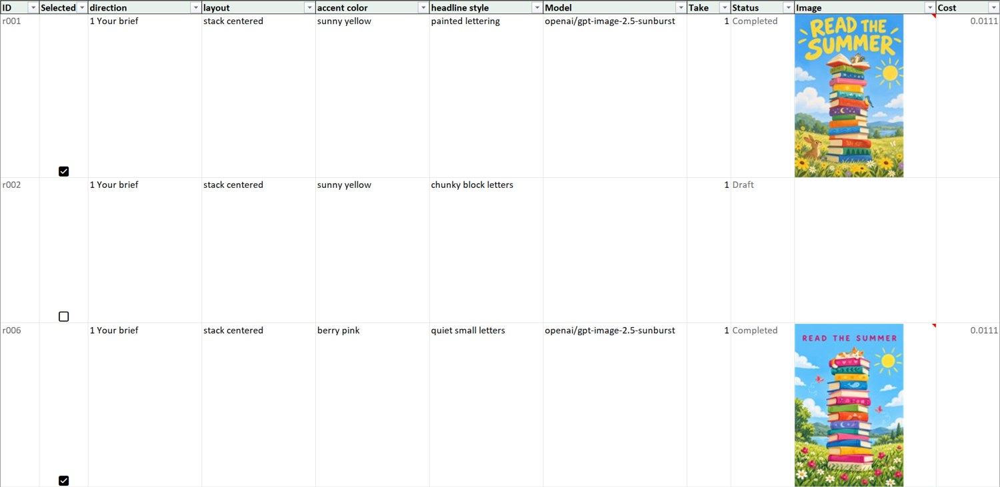

# Image Lab 2 (work in progress)

Image Lab 2 is a skill for a coding agent that generates images through the CogFoundry gateway without making you guess. It shows the **price before any spend**, generates **one image per row** of an Excel workbook where you **tick what you want**, and keeps a **ledger of every attempt**, so nothing is billed twice by accident.

It has three ways to work, and the agent picks one from what you ask:

| You ask for | Mode | What happens |
|---|---|---|
| "different creative directions for this brief" | **Creative Direction** | the agent proposes 3 to 10 distinct directions, then varies details inside each |
| "try three lighting styles and three camera angles", a reference photo, or more than 8 images | **Variation** | controlled variables, a covering batch, an Excel workbook |
| one finished prompt, a few options | **Quick** | the prompt is used as written, once per model |

## In action: four directions of one brief

An invented brief, run end to end with [`references/examples/direction-plan.json`](references/examples/direction-plan.json): *a poster for a public library's summer reading challenge, for children aged 6 to 10, headline READ THE SUMMER, portrait*. Creative Direction turned it into four directions (Direction 1 is the brief as written); each direction then varies its own layout, accent color and headline style.

**One image per direction first (a calibration), to check the directions really look different:**


Then the other 20 of the 24 planned images, one grid per direction. Every grid keeps its direction's look and varies only inside it.


**What it cost, measured:** 4 calibration images $0.0446, then 20 images $0.2229 (the quote was $0.2230), so **24 images for $0.2675** on GPT Image 2.5 Sunburst at medium quality, 1024x1536. Each paid batch was quoted first and generated only after one approval. The headline was spelled correctly in all 24 images (checked by eye; image models follow "no other text" loosely, which is why the plan carries visual checks).

## The workbook is the control surface

The agent builds `experiment.xlsx`. Each row is one image. You tick the rows you want and ignore the rest; finished rows show their thumbnail, status and cost (a hover preview shows the full image).



Ticking starts nothing. A paid run happens only after the agent has quoted the ticked rows and you have approved that quote.

## How it works, in a few lines

1. The agent writes a **plan** (`plan.json`): what stays fixed, what varies, which models.
2. It builds the **workbook** from the plan. You can edit it (tick rows, change a prompt); `refresh` merges your edits into the ledger.
3. **Preflight** reads the ticked rows, checks them and prices them. It writes an immutable **snapshot** named by a **fingerprint**: a hash of exactly what would be sent (prompts, models, sizes, reference photos) and the quoted cost.
4. You approve that fingerprint. `run --confirm <fingerprint> --max-usd N` generates exactly that snapshot and nothing else. If you change a row afterwards, the fingerprint changes and the old approval no longer covers it.
5. A **calibration** (`preflight --one-per direction`) is a cheap first batch with one image per direction; it is quoted and approved on its own, like every other paid batch.

**Creative Direction** is the first stage of that flow for an open brief: it chooses the directions to compare before any variables are set.

## Requirements and install

- Python 3 (tested on 3.13), `pip install -r requirements.txt` (XlsxWriter, openpyxl, allpairspy). **Pillow** is needed for embedded thumbnails, `montage` grids and the compact one-file gallery page.
- Excel to use the workbook (the hover preview is verified in desktop Excel only; LibreOffice and Excel for the web are untested).
- An API key from https://console.cogfoundry.ai/api-keys, needed for `run` and other paid commands (a `quick` quote is free). The token is read from `LOOMLOOM_TOKEN_COGFOUNDRY`, then `LOOMLOOM_TOKEN`, then the loomloom config file.

```bash
git clone https://github.com/cogfoundry-labs/loomloom
cd loomloom/examples/community/image-lab-2
pip install -r requirements.txt
export LOOMLOOM_TOKEN_COGFOUNDRY=...        # PowerShell: $env:LOOMLOOM_TOKEN_COGFOUNDRY = "..."
```

**Give it to your agent.** Claude Code: copy or symlink this folder to `~/.claude/skills/image-lab-2/` (not yet verified by an install test). Other agents: point them at [`SKILL.md`](SKILL.md). On Windows run Python with `PYTHONUTF8=1`.

Then ask in plain words:

- `8 options of this with Image Lab: "<finished prompt>"`
- `with Image Lab, try three lighting styles and three camera angles of this product photo`
- `with Image Lab, explore four creative directions for this campaign brief: ...`

## Status and limitations

- Usable from a checkout; **not published**. `npx skills add` installs the older v0.1, not this version.
- Tested on Windows 11 with desktop Excel. Mac and Linux are untested.
- Reference photos of people were tested as a flow (the notice, the acknowledgement), not on a range of real portraits.
- `--max-usd` limits how much new work is submitted; it is **not a hard cap** on what the gateway may bill.
- Model advice comes from measured runs on a small set of briefs: suggestive, not proof.

## Safety, in short

- Each paid batch is approved once, and an approval authorizes exactly one snapshot. Plan confirmation (no spend) is not spend approval.
- `run --confirm` is the only command that spends. `retry`, `add-takes` and `recover` only prepare a quote.
- A result whose outcome is Unknown (it may have been billed) is never retried automatically.
- The ledger records every attempt and its cost; the workbook is a view of it and can be regenerated.

## Assistant fit

`python scripts/image.py llm-advice` (free) reports how well the model behind your coding agent suits each step, from the evidence collected so far: Creative Direction, reviewing images, and writing plans. It is advice only; the evidence is in [`docs/design-v2.md`](docs/design-v2.md) and [`references/llm-fit/`](references/llm-fit).

## Files

**For you**

| Where | What |
|---|---|
| [`references/quickstart.md`](references/quickstart.md) | your first plan on one page, with complete example plans (`references/examples/`) |
| [`references/plan-schema.md`](references/plan-schema.md) | the plan file |
| [`docs/design-v2.md`](docs/design-v2.md) | the design, decisions and status |
| [`docs/v0.1-readme.md`](docs/v0.1-readme.md) | the README of Image Lab v0.1 (quick mode only, the published install, its case studies) |

**For the agent**

| Where | What |
|---|---|
| [`SKILL.md`](SKILL.md) | the rules, and the experiment steps |
| [`skills/quick.md`](skills/quick.md), [`skills/plan.md`](skills/plan.md), [`skills/direction.md`](skills/direction.md), [`skills/results.md`](skills/results.md) | one file per stage |
| `scripts/`, `tests/` | the engine (`image.py`) and 400+ offline tests (`python -m unittest discover -s tests`; they spend nothing) |

## Feedback

Open an issue on [cogfoundry-labs/loomloom](https://github.com/cogfoundry-labs/loomloom/issues) and say which mode you used and what the agent did.

Apache-2.0, like the rest of loomloom.
