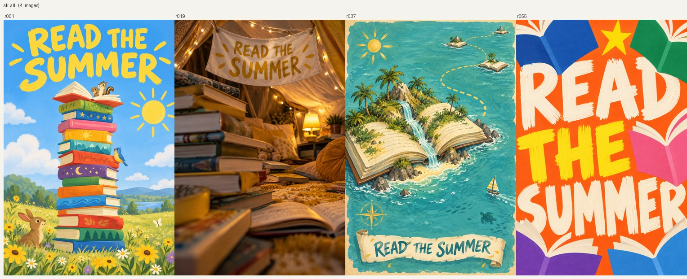
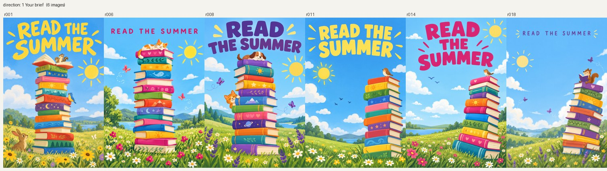
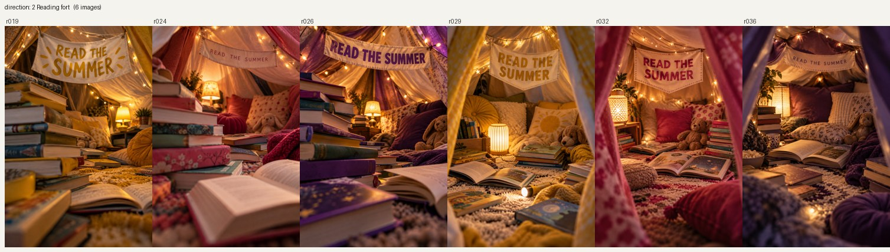
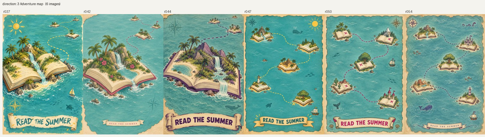
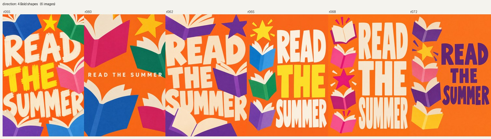

# Image Lab 2 (work in progress)

Image Lab 2 talks to the CogFoundry gateway directly (no loomloom CLI), keeps a ledger of every attempt, and adds an **experiment mode** next to the original
quick mode: controlled variations, optional reference photos, and an Excel workbook where you tick which rows to generate. One image per row, a price shown
before any spend, one approval per paid batch.

## Quick start (Image Lab 2)

Use a local checkout of this folder (Image Lab 2 is not published yet; the `npx skills add` install in the v0.1 README installs the published v0.1).

```bash
git clone https://github.com/cogfoundry-labs/loomloom
cd loomloom/examples/community/image-lab-2
pip install -r requirements.txt          # experiment mode: XlsxWriter, openpyxl, allpairspy (Pillow optional, for thumbnails)
export LOOMLOOM_TOKEN_COGFOUNDRY=...     # only needed for commands that spend (run, quick): an API key from https://console.cogfoundry.ai/api-keys
```

Then point your coding agent at [`SKILL.md`](SKILL.md) and name it in a request, for example:

- quick mode: `8 options of this with Image Lab: "<finished prompt>"`
- experiment mode: `with Image Lab, try three lighting styles and three camera angles of this product photo`
- Creative Direction: `with Image Lab, explore four creative directions for this campaign brief: ...`

The agent plans the experiment (`plan.json`, checked with `python scripts/image.py check` and `plan --dry-run`), builds `experiment.xlsx`, shows the price
(`preflight`), and generates only after your one approval (`run --confirm <fingerprint>`). On Windows run Python with `PYTHONUTF8=1`.

| Where | What |
|---|---|
| [`SKILL.md`](SKILL.md) | how the agent uses it: rules, quick mode, experiment mode |
| [`skills/plan.md`](skills/plan.md), [`skills/direction.md`](skills/direction.md) | the planner and Creative Direction stages |
| [`references/plan-schema.md`](references/plan-schema.md), [`references/examples/direction-plan.json`](references/examples/direction-plan.json) | the plan file and a complete four-direction example |
| [`docs/design-v2.md`](docs/design-v2.md) | the design, decisions and status |
| `scripts/`, `tests/` | the engine (`image.py`) and 300+ offline tests (`python -m unittest discover -s tests`; they spend nothing) |
| `experiments/` | the control experiments that gated the build |

`python scripts/image.py llm-advice` (free) reports how well your assistant's model suits each step, from the evidence collected so far; it is advice only.

## Image Lab 2 in action: four directions of one brief

An invented brief, run end to end with [`references/examples/direction-plan.json`](references/examples/direction-plan.json): *a poster for a public library's summer reading challenge, for children aged 6 to 10, headline READ THE SUMMER, portrait*. Creative Direction turned it into four directions (Direction 1 is the brief as written); each direction then varies its own layout, an accent color and the headline style.

**One image per direction first (a calibration), to check the directions really look different:**



Then the other 20 of the 24 planned images, one grid per direction. Every grid keeps its direction's look and varies only inside it.






**What it cost, measured:** 4 calibration images $0.0446, then 20 images $0.2229 (the quote was $0.2230), so **24 images for $0.2675** on GPT Image 2.5 Sunburst at medium quality, 1024x1536. Each paid batch was quoted first and generated only after one approval. The headline was spelled correctly in all 24 images (checked by eye; image models follow "no other text" loosely, which is why the plan carries visual checks). Grids made with `python scripts/image.py montage --dir <experiment> --by direction`.

The README of the previous version (Image Lab v0.1: quick mode only, the published `npx skills add ... --skill image-lab` install, and its case studies) is kept in [`docs/v0.1-readme.md`](docs/v0.1-readme.md).

Apache-2.0, like the rest of loomloom.
